# 🤝 Validra GitHub Issue & Pull Request Workflow Guide

This guide defines the end-to-end contribution, issue tracking, and pull request workflow for **Team Validra (M1 to M6)** and QA testers.

---

## 👥 Team Domain Ownership Matrix

Every task, issue, and pull request MUST be tagged with its primary domain owner:

| Domain ID | Responsibility | Core Scope | GitHub Tag |
|:---:|:---|:---|:---:|
| **M1** | 🎨 **Frontend & Presentation** | Next.js, UI/UX, Scanning interface, Enforcement Dashboard, Reports UI, Evidence viewer | `frontend` |
| **M2** | ⚙️ **Backend & Infrastructure** | FastAPI, REST APIs, PostgreSQL, Auth/JWT, RBAC, Object Storage, Task orchestration | `backend` / `db` |
| **M3** | 👁️ **Computer Vision & OCR** | OpenCV preprocessing, OCR engine, Text detection, Bounding boxes, Readability analysis | `cv` |
| **M4** | ⚖️ **Rule Engine** | Legal Metrology rule formalization, Validation logic, Violation severity, Rule repository | `rule-engine` |
| **M5** | 🧠 **RAG & AI** | Legal document ingestion, Vector embeddings, Context retrieval, LLM explanations | `rag` |
| **M6** | 🔬 **Research & QA** | Datasets, Model benchmarking, Rule validation testing, E2E testing, SIH docs | `qa` / `research` |

---

## 🔄 End-to-End Task Lifecycle

```mermaid
flowchart LR
    A["1️⃣ Issue Created<br/><i>(Bug / Feature / Rule / QA)</i>"] --> B["2️⃣ Triage & Assign<br/><i>(Assign M1–M6 Lead)</i>"]
    B --> C["3️⃣ Feature Branch Created<br/><i>(feature/domain-task)</i>"]
    C --> D["4️⃣ Local Dev & Test<br/><i>(Write code & tests)</i>"]
    D --> E["5️⃣ Open Pull Request<br/><i>(Use PR Template)</i>"]
    E --> F["6️⃣ QA & Peer Review<br/><i>(M6 Testing & Checklists)</i>"]
    F --> G["7️⃣ Merge to main<br/><i>(Auto-close linked Issue)</i>"]

    style A fill:#0d1117,stroke:#58a6ff,color:#fff
    style E fill:#0d1117,stroke:#7c3aed,color:#fff
    style F fill:#0d1117,stroke:#ff9800,color:#fff
    style G fill:#0d3b0d,stroke:#00c853,color:#fff
```



---

## 📑 1. Creating Issues

Use the structured GitHub Issue templates:

1. **🐛 Bug Report**: Use when encountering exceptions, unexpected behavior, UI glitches, or broken endpoints.
2. **💡 Feature Request**: Use for introducing new capabilities across M1-M6 domains.
3. **⚖️ Legal Rule Addition**: Use when converting a Legal Metrology Act 2009 or PC Rule 2011 provision into code.
4. **🔬 QA & Benchmarking Task**: Use for OCR evaluation runs, test dataset uploads, or API performance testing.

---

## 🌿 2. Git Branch Naming Convention

Create branches using domain prefixing:

```bash
# Format: <type>/<domain>-<short-description>

git checkout -b feature/m1-camera-scanner-ui
git checkout -b feature/m2-fastapi-scan-endpoint
git checkout -b feature/m3-opencv-perspective-crop
git checkout -b feature/m4-rule-mrp-validation
git checkout -b feature/m5-rag-vector-retrieval
git checkout -b bugfix/m2-db-connection-retry
git checkout -b qa/m6-ocr-accuracy-benchmark
```

---

## 📬 3. Submitting Pull Requests

When opening a PR:

1. **Title Format**: `[TYPE][DOMAIN] Short title`
   - Example: `[FE][M1] Add camera scan interface`
   - Example: `[BE][M2] Add POST /scans endpoint`
   - Example: `[CV][M3] Integrate PaddleOCR text localization`
   - Example: `[RE][M4] Add MRP declaration validation rule`
2. **Fill out the PR Template**: Check all applicable checkboxes (Type of Change, Domain Ownership, Testing Checklist).
3. **Link the Issue**: Use `Closes #123` or `Fixes #123` in the PR description to automatically resolve the issue upon merge.
4. **Attach Evidence**: Screenshots for UI changes (M1), JSON responses for APIs (M2/M3/M4/M5), or benchmark metrics for QA (M6).

---

## 🧪 4. Fast-Track Testing Guidance for QA (M6)

QA Testers (M6) should verify PRs against these critical criteria:

1. **Confidence Propagation**: Does the change preserve OCR bounding boxes and confidence scores?
2. **Decision States**: Are outcomes correctly classified as `COMPLIANT`, `NON-COMPLIANT`, or `NEEDS REVIEW`?
3. **Evidence Preservation**: Is the original product image and cropped evidence region preserved?
4. **No Hardcoded Secrets**: Ensure `.env` is not committed and no credentials are present in code.
