#

<p align="center">
  
</p>

<p align="center">
  <strong>"See → Extract → Validate → Explain → Evidence → Report → Review"</strong>
</p>

<p align="center">
  
  
  
  <a href="./LICENSE">
    
  </a>
</p>

<p align="center">
  
  
  
  
  
  
  
</p>

---

## 📖 Overview

**Validra** is an AI-assisted compliance checking system designed to help
inspect packaged commodities against applicable requirements under
India's **Legal Metrology Act, 2009** and **Legal Metrology (Packaged
Commodities) Rules, 2011**.

The platform analyzes product/package images and product information,
extracts mandatory declarations, evaluates them through a rule-based
compliance engine, retrieves relevant legal context using RAG, and
generates evidence-backed compliance reports.

> 🌟 **Smart India Hackathon 2026 — Problem Statement ID: 26034**

---

## 📑 Table of Contents

- [🎯 Problem](#-problem)
- [💡 Solution](#-solution)
- [🧠 Why Validra?](#-why-validra)
- [🚀 Key Features](#-key-features)
- [🏗️ System Design & Architecture](#-system-design--architecture)
- [🔄 Processing Pipeline](#-processing-pipeline)
- [⚖️ Rule Engine + RAG](#-rule-engine--rag)
- [📊 Confidence-Aware Inspection](#-confidence-aware-inspection)
- [🗃️ Core Data Model](#-core-data-model)
- [🔌 API Overview](#-api-overview)
- [🧩 Technology Stack](#-technology-stack)
- [📁 Repository Structure](#-repository-structure)
- [🧪 Testing Strategy](#-testing-strategy)
- [🛡️ Responsible AI & Legal Disclaimer](#-responsible-ai--legal-disclaimer)
- [🛠️ Development Roadmap](#-development-roadmap)
- [👥 Team Domains](#-team-domains)
- [🤝 Contribution Workflow](#-contribution-workflow)
- [🚀 Getting Started](#-getting-started)
- [📖 Interactive Documentation](#-interactive-documentation)
- [🏆 Smart India Hackathon 2026](#-smart-india-hackathon-2026)
- [📌 Status](#-status)
- [📄 License](#-license)
- [🌟 Support Our Mission](#-support-our-mission)

---

## 🎯 Problem

Packaged commodities sold through retail stores, supermarkets, and
e-commerce platforms are expected to carry prescribed declarations such
as manufacturer/packer/importer details, net quantity, MRP, date-related
information, consumer-care details, and other applicable declarations.

Manual inspection across a large and diverse product ecosystem is
time-consuming and resource-intensive. Validra aims to assist
enforcement personnel by automating the initial inspection, extraction,
validation, evidence collection, and reporting workflow.

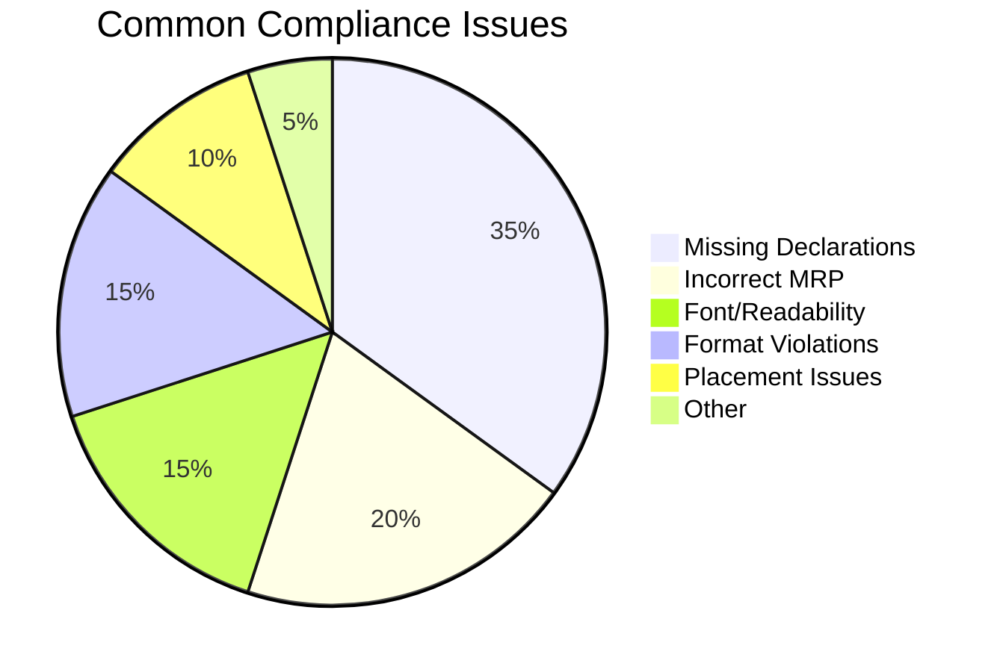

---

## 💡 Solution

Validra follows an evidence-first pipeline:

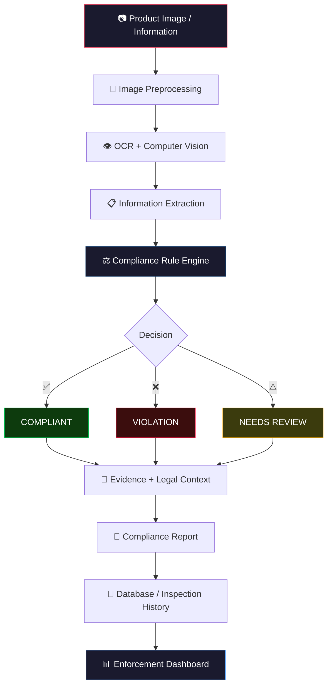

### Core Principle

**AI extracts and assists → Rules evaluate → RAG explains and references
→ Human reviews uncertain cases.**

Validra is a decision-support system, not a replacement for authorized
legal or enforcement judgment. AI/CV outputs are accompanied by
confidence information, and uncertain cases can be routed for manual
review.

---

## 🧠 Why Validra?

| ❌ Traditional Manual Inspection | ✅ Validra — AI-Assisted Inspection |
|:---|:---|
| 🐢 Slow, manual label reading | ⚡ Instant AI-powered scanning |
| 📝 Paper-based records | 💾 Digital evidence preservation |
| 🧑 Single inspector bottleneck | 🤖 Scalable, consistent checks |
| 🔍 Misses subtle violations | 🎯 Detects missing/incorrect declarations |
| 📊 No analytics or trends | 📊 Real-time enforcement dashboard |
| 🗂️ Hard to retrieve past records | 🔎 Searchable inspection history |

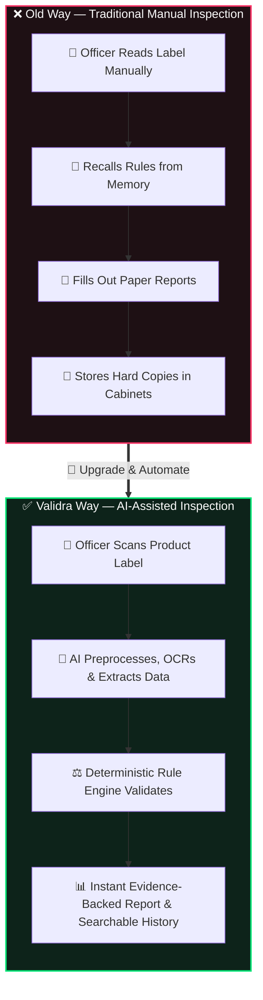

---

## 🚀 Key Features

### 📷 Product Scanning

-   Upload or capture packaged commodity images.
-   Process package and label images.
-   Preserve original and processed evidence.

### 👁️ Computer Vision & OCR

-   Image preprocessing using OpenCV.
-   Text detection and OCR.
-   Bounding-box based text localization.
-   Relevant label-region extraction.
-   Readability and font-related analysis where technically measurable.

### 🧾 Information Extraction

Identify structured fields such as:

-   MRP
-   Net quantity
-   Manufacturer
-   Packer
-   Importer
-   Manufacturing/packing/import-related date information
-   Consumer-care information
-   Other applicable declarations

### ⚖️ Rule-Based Compliance Engine

-   Check required declarations.
-   Validate extracted values and formats.
-   Apply category-specific rules where applicable.
-   Detect missing or potentially non-compliant declarations.
-   Classify findings by severity.
-   Maintain rule references and versions.

### 🧠 RAG & Legal Intelligence

-   Ingest authoritative legal/regulatory documents.
-   Retrieve relevant provisions for findings.
-   Provide contextual explanations.
-   Connect findings with supporting legal references.

### 📊 Enforcement Dashboard

-   Inspection statistics.
-   Compliance/non-compliance trends.
-   Violation categories.
-   Product and inspection history.
-   Search and retrieval of previous inspections.

### 📄 Compliance Reports

Generate reports containing:

-   Product information
-   Extracted declarations
-   Compliance status
-   Violations
-   Evidence images
-   Evidence locations
-   Confidence values
-   Applicable legal references
-   Inspection metadata

### 🔐 Security

-   Authentication
-   Role-based access
-   Protected APIs
-   Inspection history
-   Audit records

---

## 🏗️ System Design & Architecture

### High-Level System Architecture

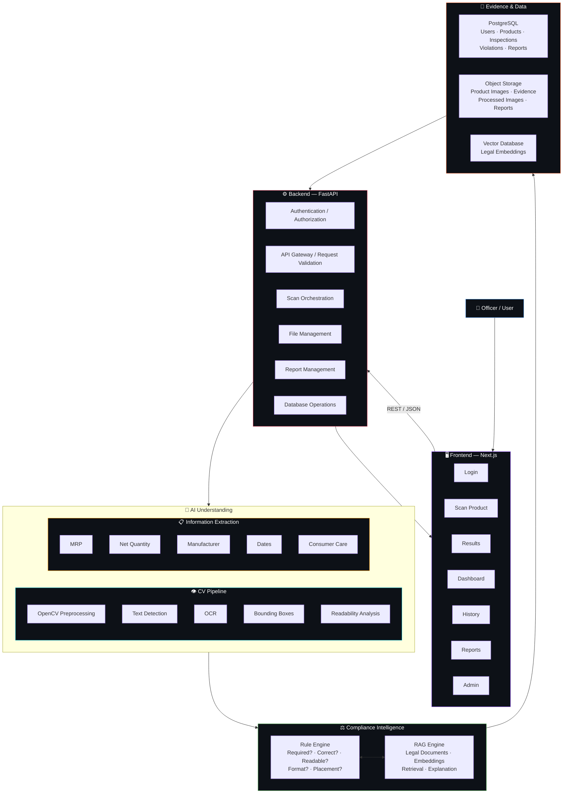

### Five-Layer Architecture

``` text
┌───────────────────────────────────────────┐
│              USER EXPERIENCE              │
│     Next.js • Scan • Dashboard • Reports  │
├───────────────────────────────────────────┤
│              ORCHESTRATION                │
│       FastAPI • Auth • APIs • DB          │
├───────────────────────────────────────────┤
│             AI UNDERSTANDING              │
│      OpenCV • OCR • CV • Extraction       │
├───────────────────────────────────────────┤
│            COMPLIANCE INTELLIGENCE        │
│       Rule Engine • RAG • Legal Context   │
├───────────────────────────────────────────┤
│             EVIDENCE & DATA               │
│ PostgreSQL • Object Storage • Vector DB   │
└───────────────────────────────────────────┘
```

### Complete Inspection Sequence

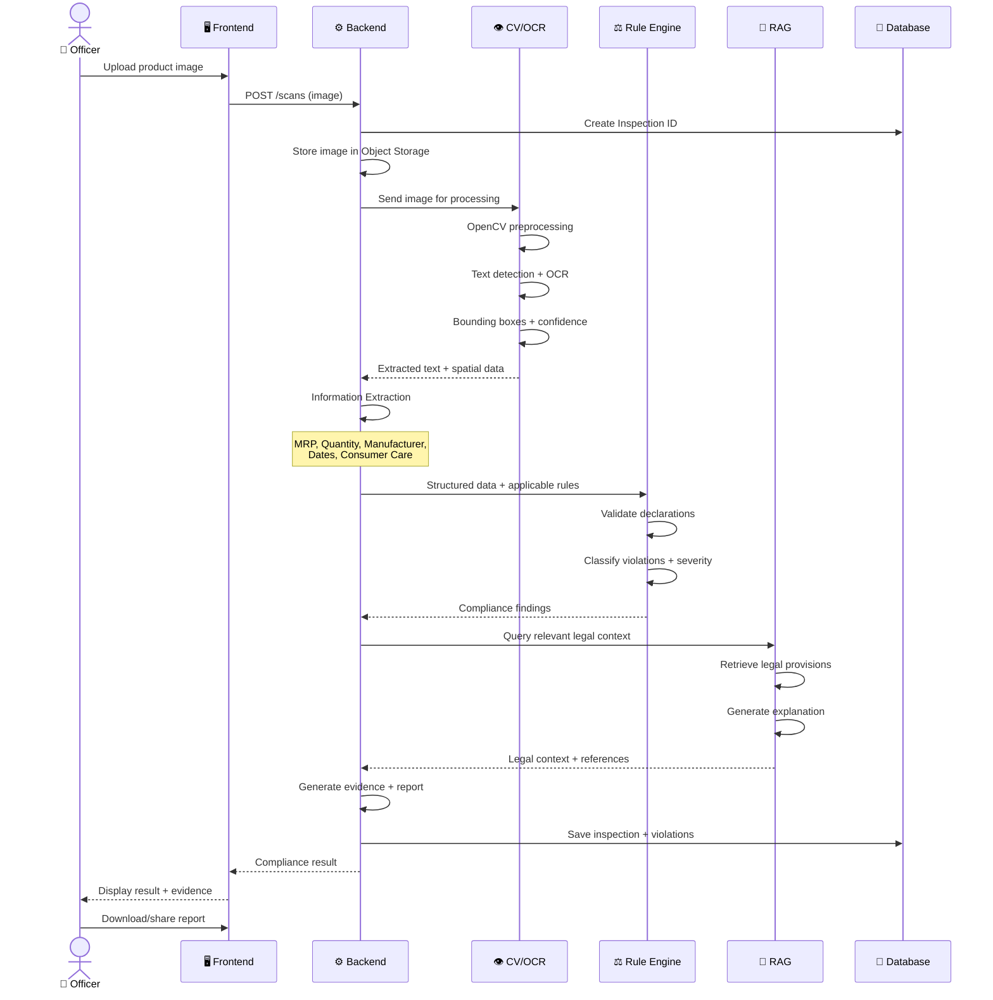

---

## 🔄 Processing Pipeline

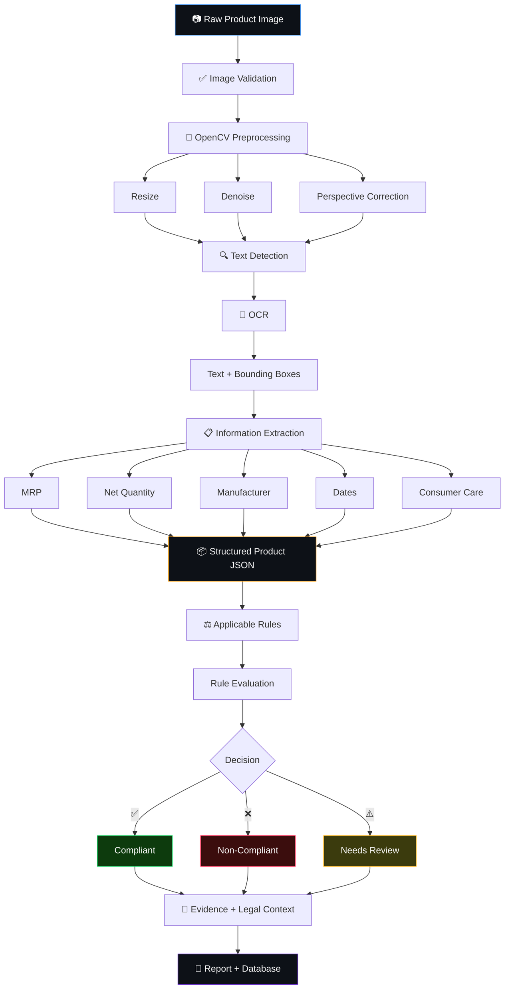

Example OCR output:

``` json
{
  "text": "MRP ₹50",
  "confidence": 0.96,
  "bbox": [120, 340, 280, 390]
}
```

Example extracted field:

``` json
{
  "mrp": {
    "value": 50.0,
    "currency": "INR",
    "confidence": 0.96
  }
}
```

---

## ⚖️ Rule Engine + RAG

Validra separates **compliance decisions** from **language generation**.

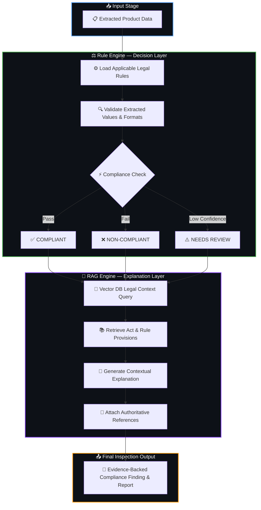

The rule engine provides deterministic validation wherever requirements
can be expressed as rules. RAG retrieves supporting regulatory context
and helps explain findings; it should not independently make the final
legal decision.

### Rule Engine Decision States

| State | Icon | Meaning | When Used |
|:------|:-----|:--------|:----------|
| **Compliant** | ✅ | Declaration passes validation | High confidence, rule satisfied |
| **Non-Compliant** | ❌ | Violation detected | Declaration missing/invalid, high confidence |
| **Needs Review** | ⚠️ | Uncertain result | Low OCR/extraction confidence |

---

## 📊 Confidence-Aware Inspection

Validra tracks uncertainty throughout the AI pipeline.

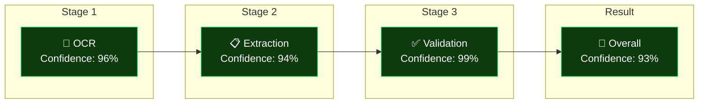

### High vs Low Confidence Examples

| Stage | ✅ High Confidence | ⚠️ Low Confidence |
|:------|:-------------------|:-------------------|
| OCR | 96% | 48% |
| Extraction | 94% | 42% |
| Validation | 99% | — |
| **Overall** | **93%** | **Low** |
| **Result** | ✅ `COMPLIANT` | ⚠️ `NEEDS REVIEW` |

This reduces false certainty and helps officers focus on ambiguous
cases.

---

## 🗃️ Core Data Model

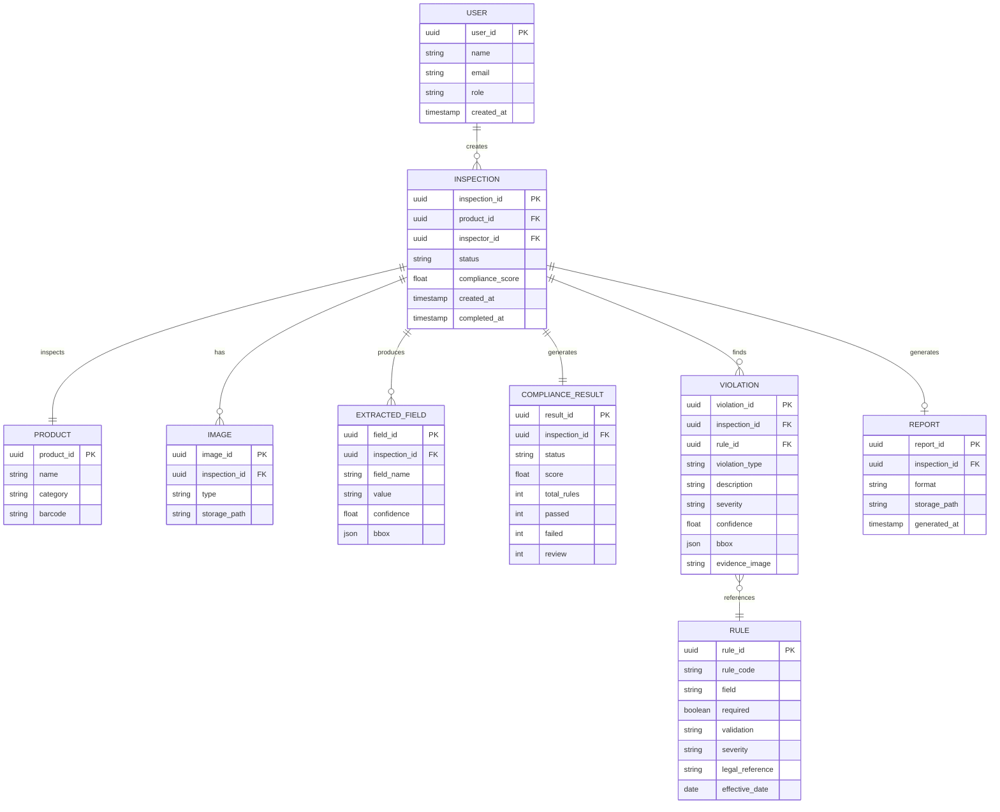

Potential entities:

``` text
users
products
inspections
images
extracted_fields
compliance_results
violations
rules
reports
audit_logs
```

| Table | Purpose | Key Relationships |
|:------|:--------|:------------------|
| `users` | Officer/admin accounts | Creates inspections |
| `products` | Product information | Inspected via inspections |
| `inspections` | Core inspection record | Links all entities |
| `images` | Original + processed images | Belong to inspection |
| `extracted_fields` | OCR/extraction results | Per inspection, with confidence |
| `compliance_results` | Overall compliance status | One per inspection |
| `violations` | Individual violations found | References rules |
| `rules` | Legal compliance rules | Referenced by violations |
| `reports` | Generated PDF reports | One per inspection |
| `audit_logs` | Who did what, when | System-wide tracking |

---

## 🔌 API Overview

| Method | Endpoint | Purpose | Auth |
|:-------|:---------|:--------|:----:|
| `POST` | `/auth/login` | Authenticate user | ❌ |
| `POST` | `/scans` | Upload/start inspection | ✅ |
| `GET` | `/scans/{id}` | Get processing status | ✅ |
| `GET` | `/inspections/{id}` | Retrieve inspection | ✅ |
| `GET` | `/products` | Search products | ✅ |
| `GET` | `/violations` | Retrieve violations | ✅ |
| `GET` | `/dashboard` | Dashboard statistics | ✅ |
| `POST` | `/reports/{id}` | Generate report | ✅ |
| `GET` | `/reports/{id}` | Retrieve report | ✅ |

API contracts should be versioned and documented through
FastAPI/OpenAPI.

<details>
<summary><strong>📡 Example API Usage</strong></summary>

**Start Inspection:**
```http
POST /scans
Content-Type: multipart/form-data

image = product.jpg
```

**Response:**
```json
{
  "inspection_id": "INS-000124",
  "status": "processing"
}
```

**Poll for result:**
```http
GET /scans/INS-000124
```

```json
{
  "status": "completed",
  "compliance_status": "non_compliant",
  "score": 78,
  "violations": 2
}
```

</details>

---

## 🧩 Technology Stack

| Layer | Technology | Badge | Purpose |
|:------|:-----------|:------|:--------|
| **Frontend** | Next.js, TypeScript |   | High-performance, SEO-friendly UI |
| **UI** | Tailwind CSS, shadcn/ui |   | Modern utility-first styling |
| **Backend** | FastAPI, Python |   | Async REST API & orchestration |
| **Database** | PostgreSQL |  | Relational data storage |
| **Computer Vision** | OpenCV |  | Image preprocessing & analysis |
| **OCR** | PaddleOCR / selected engine |  | Text recognition |
| **ML/NLP** | spaCy, scikit-learn |  | NLP & extraction |
| **RAG** | Embeddings + Vector DB |  | Legal document retrieval |
| **LLM** | Configurable provider |  | Explanation generation |
| **Auth** | JWT / configurable |  | Authentication & authorization |
| **Reports** | ReportLab |  | PDF report generation |
| **API** | REST / JSON |  | API protocol |

Technology choices may evolve based on accuracy, benchmarks, cost, and
deployment constraints.

---

## 📁 Repository Structure

``` text
validra/
│
├── frontend/                 # Next.js application
│   ├── app/
│   ├── components/
│   ├── lib/
│   └── public/
│
├── backend/                  # FastAPI application
│   ├── app/
│   │   ├── api/              # Route handlers
│   │   ├── core/             # Config, security
│   │   ├── database/         # DB connections
│   │   ├── models/           # SQLAlchemy models
│   │   ├── schemas/          # Pydantic schemas
│   │   └── services/         # Business logic
│   └── requirements.txt
│
├── cv/                       # Computer Vision & OCR
│   ├── preprocessing/
│   ├── detection/
│   ├── ocr/
│   └── extraction/
│
├── rule-engine/              # Compliance rule system
│   ├── rules/
│   ├── validators/
│   ├── evaluators/
│   └── schemas/
│
├── rag/                      # Legal RAG pipeline
│   ├── ingestion/
│   ├── retrieval/
│   ├── embeddings/
│   └── generation/
│
├── research/                 # Legal research, datasets, benchmarks
├── tests/                    # Unit, integration & E2E tests
│
├── docs/                     # 📖 Interactive MDX documentation
│   └── base_setup.mdx        # Beginner-friendly environment setup
│
├── .env.example
├── .gitignore
└── README.md
```

---

## 🧪 Testing Strategy

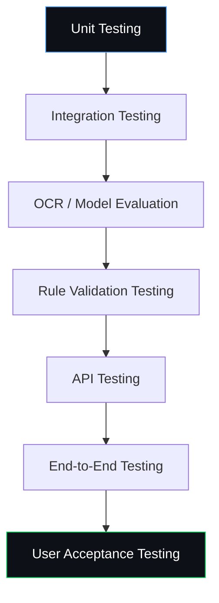

Important test cases include:

-   Clear images
-   Blurred images
-   Rotated images
-   Low-light images
-   Missing declarations
-   Incorrect formats
-   OCR errors
-   Low-confidence extraction
-   Multiple product categories
-   Conflicting information
-   API failures
-   Unauthorized access
-   Report-generation failures

### Evaluation Metrics

| Domain | Metrics |
|:-------|:--------|
| **OCR / Extraction** | Character/Word Error Rate, Field Accuracy, Precision, Recall, F1-score |
| **Computer Vision** | Detection Precision/Recall, IoU where applicable |
| **Compliance Engine** | Rule Validation Accuracy, False-Positive Rate, False-Negative Rate, Violation Classification |
| **System** | Average Processing Time, API Latency, Successful Processing Rate, Report Generation Time |

---

## 🛡️ Responsible AI & Legal Disclaimer

Validra is an **AI-assisted inspection and decision-support system**.

The system should:

-   ✅ Preserve supporting evidence.
-   ✅ Display confidence levels.
-   ✅ Provide applicable rule references.
-   ✅ Flag uncertain cases for manual review.
-   ❌ Avoid presenting low-confidence AI outputs as definitive legal
    conclusions.

> **Final legal interpretation and enforcement action should remain with the authorized authority.**

---

## 🛠️ Development Roadmap

```mermaid
flowchart TD
    subgraph P1["Phase 1: 🏗️ Foundation"]
        direction TB
        P1A["Repo Setup"] --> P1B["Next.js + FastAPI Skeleton"]
        P1B --> P1C["PostgreSQL Schema"]
        P1C --> P1D["Auth & API Contracts"]
    end

    subgraph P2["Phase 2: 🔧 Core AI Pipeline"]
        direction TB
        P2A["Image Upload API"] --> P2B["OpenCV Preprocessing"]
        P2B --> P2C["OCR & Bounding Boxes"]
        P2C --> P2D["Field Extraction & Initial Rules"]
    end

    subgraph P3["Phase 3: 🧠 Compliance Intelligence"]
        direction TB
        P3A["Rule Repository & Evaluator"] --> P3B["Violation Classification"]
        P3B --> P3C["Confidence Propagation"]
        P3C --> P3D["Evidence Region Localization"]
    end

    subgraph P4["Phase 4: 📚 Legal RAG Engine"]
        direction TB
        P4A["Legal Doc Ingestion"] --> P4B["Chunking & Embeddings"]
        P4B --> P4C["Vector Search & Retrieval"]
        P4C --> P4D["Contextual Explanation Gen"]
    end

    subgraph P5["Phase 5: 🚀 Productization"]
        direction TB
        P5A["Enforcement Dashboard"] --> P5B["Inspection History & Search"]
        P5B --> P5C["PDF Compliance Reports"]
        P5C --> P5D["Role-Based Access & Audit Logs"]
    end

    subgraph P6["Phase 6: ✅ Validation & Deployment"]
        direction TB
        P6A["Model & Rule Benchmarking"] --> P6B["End-to-End System Testing"]
        P6B --> P6C["Security Audits & Optimization"]
        P6C --> P6D["Production Deployment & SIH Demo"]
    end

    P1 --> P2 --> P3 --> P4 --> P5 --> P6

    style P1 fill:#0d1117,stroke:#58a6ff,stroke-width:2px,color:#fff
    style P2 fill:#0d1117,stroke:#00bcd4,stroke-width:2px,color:#fff
    style P3 fill:#0d1117,stroke:#ff9800,stroke-width:2px,color:#fff
    style P4 fill:#0d1117,stroke:#7c3aed,stroke-width:2px,color:#fff
    style P5 fill:#0d1117,stroke:#e94560,stroke-width:2px,color:#fff
    style P6 fill:#0d1117,stroke:#00c853,stroke-width:2px,color:#fff
```

### Phase 1 — Foundation

-   [ ] Repository setup
-   [ ] Next.js frontend
-   [ ] FastAPI backend
-   [ ] PostgreSQL schema
-   [ ] Authentication
-   [ ] API contracts

### Phase 2 — Core AI Pipeline

-   [ ] Image upload
-   [ ] OpenCV preprocessing
-   [ ] OCR integration
-   [ ] Bounding-box extraction
-   [ ] Mandatory-field extraction
-   [ ] Initial compliance rules

### Phase 3 — Compliance Intelligence

-   [ ] Rule repository
-   [ ] Rule evaluator
-   [ ] Violation classification
-   [ ] Confidence propagation
-   [ ] Evidence localization

### Phase 4 — RAG

-   [ ] Legal document ingestion
-   [ ] Chunking
-   [ ] Embeddings
-   [ ] Vector search
-   [ ] Relevant-rule retrieval
-   [ ] Explanation generation

### Phase 5 — Productization

-   [ ] Enforcement dashboard
-   [ ] Inspection history
-   [ ] PDF reports
-   [ ] Search and filtering
-   [ ] Role-based access
-   [ ] Audit logs

### Phase 6 — Validation & Deployment

-   [ ] Dataset creation
-   [ ] Model benchmarking
-   [ ] End-to-end testing
-   [ ] Security testing
-   [ ] Performance optimization
-   [ ] Deployment
-   [ ] Documentation
-   [ ] SIH demonstration

---

## 👥 Team Domains

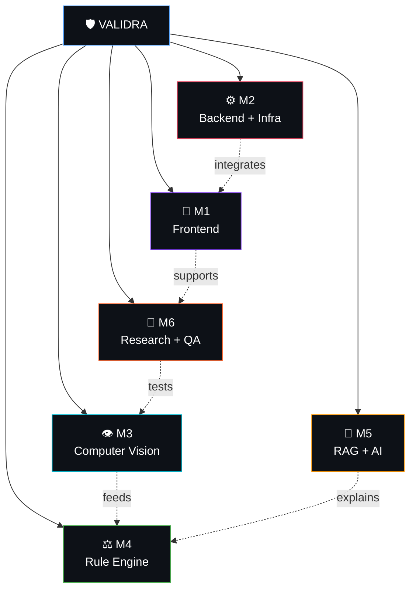

| Domain | Responsibility |
|:-------|:---------------|
| 🎨 **Frontend** | Next.js, UI/UX, dashboard, scanning workflow |
| ⚙️ **Backend & Infrastructure** | FastAPI, APIs, DB, Auth, storage, deployment |
| 👁️ **Computer Vision** | OpenCV, OCR, detection, readability analysis |
| ⚖️ **Rule Engine** | Legal rules, validation, violations, compliance scoring |
| 🧠 **RAG & AI** | Legal retrieval, embeddings, LLM integration |
| 🔬 **Research & QA** | Legal research, datasets, evaluation, testing, documentation |

All members contribute to integration, debugging, and final system
validation.

---

## 🤝 Contribution Workflow

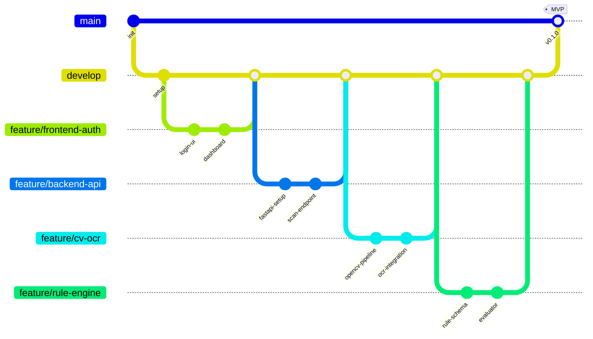

Recommended Git workflow:

``` text
main
 │
 └── develop
       │
       ├── feature/frontend-*   (M1)
       ├── feature/backend-*    (M2)
       ├── feature/cv-*         (M3)
       ├── feature/rule-engine-* (M4)
       ├── feature/rag-*        (M5)
       └── feature/qa-*         (M6)
```

### 📋 Issue & Pull Request Templates

We have established end-to-end GitHub templates for streamlined tracking:

- 🐛 **[Bug Report Form](https://github.com/dhruvpatel16120/Validra/issues/new?template=bug_report.yml)** — Structured bug submission tagged by team domain (M1–M6) & component type.
- 💡 **[Feature Request Form](https://github.com/dhruvpatel16120/Validra/issues/new?template=feature_request.yml)** — Propose new features with user story and acceptance criteria.
- ⚖️ **[Legal Rule Addition Form](https://github.com/dhruvpatel16120/Validra/issues/new?template=rule_addition.yml)** — Formalize Legal Metrology Act/PC Rules into machine rules.
- 🔬 **[QA & Benchmarking Task Form](https://github.com/dhruvpatel16120/Validra/issues/new?template=qa_test_task.yml)** — Track OCR evaluation runs, test datasets, and performance tests.
- 🔀 **[PR Templates](.github/PULL_REQUEST_TEMPLATE.md)** — Standardized PR templates with domain tags (M1–M6), type selectors (`frontend`, `backend`, `db`), testing checklists, and visual evidence sections.

> 📖 **Complete Developer & QA Workflow Guide:** See [`.github/WORKFLOW_GUIDE.md`](.github/WORKFLOW_GUIDE.md) for full branch naming, issue-linking, and QA verification procedures.

Before opening a pull request:

-   ✅ Keep changes focused.
-   ✅ Tag primary domain (`M1` to `M6`) and component type (`frontend`, `backend`, `db`, `cv`, `rule-engine`, `rag`, `qa`).
-   ✅ Test locally.
-   ✅ Update documentation when required.
-   ❌ Never commit secrets or `.env` files.
-   ✅ Add/update tests for important functionality.
-   ✅ Explain what changed and attach visual/test evidence.

---

## 🚀 Getting Started

### Prerequisites

| Tool | Version | Purpose |
|:-----|:--------|:--------|
| Git | Latest | Version control |
| Node.js | 18+ LTS | Frontend runtime |
| Python | 3.10+ | Backend + AI |
| PostgreSQL | 15+ | Database |
| OCR/CV deps | — | Required OCR/CV dependencies |

> 📖 **New to development?** Check our **[Base Setup Guide](./docs/base_setup.mdx)** for step-by-step installation instructions starting from scratch!

### Clone

``` bash
git clone https://github.com/dhruvpatel16120/Validra.git
cd validra
```

### Frontend

``` bash
cd frontend
npm install
npm run dev
```

### Backend

``` bash
cd backend
python -m venv .venv

# Linux/macOS
source .venv/bin/activate

# Windows
.venv\Scripts\activate

pip install -r requirements.txt
uvicorn app.main:app --reload
```

> ⚠️ **Important:** Create your local `.env` from `.env.example`. Never commit API keys, passwords, or private credentials.

---

## 📖 Interactive Documentation

Validra uses **MDX** (Markdown + JSX) for interactive, component-rich documentation with embedded **Mermaid diagrams** for visual system explanations.

| Document | Description | Status |
|:---------|:------------|:------:|
| [`docs/base_setup.mdx`](./docs/base_setup.mdx) | 🟢 Base environment setup guide (Git, IDE, Node, Python, PostgreSQL) | ✅ Available |
| `docs/frontend_setup.mdx` | 🔵 Frontend development environment setup | 🔜 Coming Soon |
| `docs/backend_setup.mdx` | 🟣 Backend development environment setup | 🔜 Coming Soon |
| `docs/architecture.md` | System architecture deep-dive | 🔜 Planned |
| `docs/api.md` | API documentation | 🔜 Planned |
| `docs/database.md` | Database schema & migrations | 🔜 Planned |
| `docs/cv-pipeline.md` | CV/OCR pipeline documentation | 🔜 Planned |
| `docs/rule-engine.md` | Rule engine documentation | 🔜 Planned |
| `docs/rag.md` | RAG pipeline documentation | 🔜 Planned |
| `docs/testing.md` | Testing strategy & guidelines | 🔜 Planned |

### Why MDX + Mermaid?

- 📊 **Mermaid Diagrams** — Flowcharts, sequence diagrams, ER diagrams, and more rendered directly in documentation
- ⚛️ **MDX Components** — Interactive callouts, tabs, steps, and code blocks
- 🔄 **Version Controlled** — Documentation lives with the code
- 🎨 **Beautiful Rendering** — Rich formatting with syntax highlighting

---

## 🏆 Smart India Hackathon 2026

| Field | Details |
|:------|:--------|
| **Problem Statement** | 26034 |
| **Organization** | Ministry of Consumer Affairs, Food & Public Distribution |
| **Department** | Department of Consumer Affairs (DoCA) |
| **Category** | Software |
| **Theme** | Miscellaneous |
| **Project** | **Validra — Intelligent Product Compliance** |

> **Validra — Intelligent Product Compliance.**

---

## 📌 Status

🚧 **Active Development**

The architecture and module boundaries are being established. Model
selection, rule coverage, datasets, and implementation details will be
validated experimentally during development.

---

## 📄 License

Distributed under the terms of the **Apache License 2.0**. See [`LICENSE`](./LICENSE) for full details and license text.

---

## 🌟 Support Our Mission

> 💡 **Enforcement Intelligence for Consumer Protection**

If you find **Validra** impactful, innovative, or useful in advancing AI-powered compliance for Legal Metrology, please consider giving this repository a **Star**! ⭐ Your support helps us gain visibility, foster open-source collaboration, and bridge the digital enforcement gap.

<p align="center">
  <a href="https://github.com/dhruvpatel16120/Validra">
    
  </a>
</p>

<br/>

<p align="center">Made with ❤️ for <b>Smart India Hackathon 2026</b> by <b>Team Validra</b></p>
