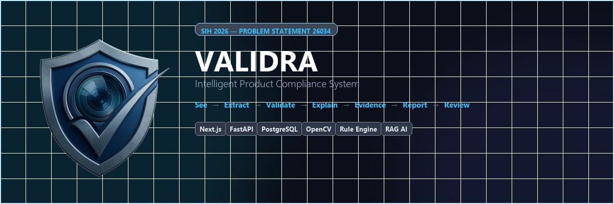
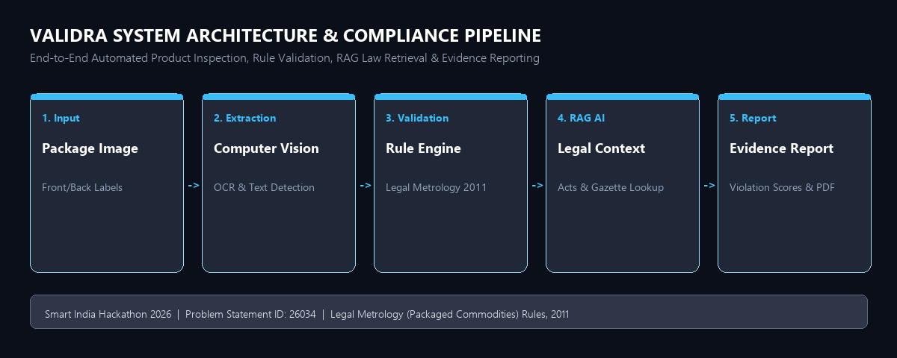
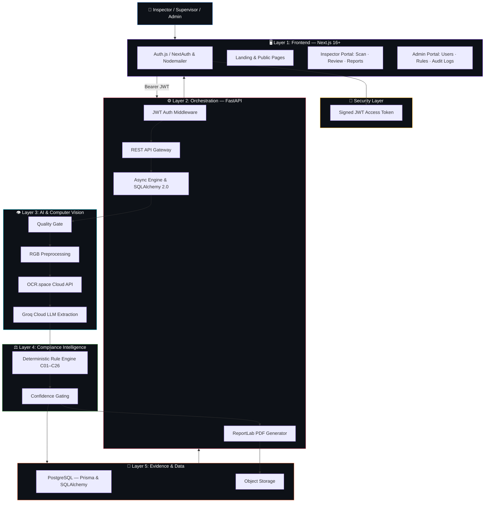
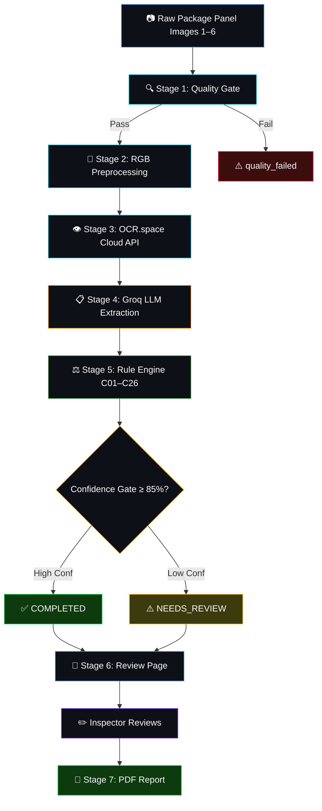

<p align="center">
  <a href="https://github.com/dhruvpatel16120/Validra">
    
  </a>
</p>

<h1 align="center">VALIDRA</h1>

<p align="center">
  <strong>Intelligent Product Compliance System</strong><br/>
  <em>"See → Extract → Validate → Evidence → Report → Review"</em><br/>
  <strong>Team: GECR6</strong>
</p>

<p align="center">
  
</p>

<p align="center">
  
  
  
  <a href="./LICENSE">
    
  </a>
</p>

<p align="center">
  
  
  
  
  
  
  
  
</p>

---

## 📖 Overview

**Validra** is an AI-assisted compliance checking system designed to help inspect packaged commodities against applicable requirements under India's **Legal Metrology Act, 2009** and **Legal Metrology (Packaged Commodities) Rules, 2011**.

The platform analyzes product/package images, extracts mandatory declarations using OCR and LLM-based field extraction, evaluates them through a deterministic rule-based compliance engine, and generates evidence-backed compliance reports.

> 🌟 **Smart India Hackathon 2026 — Problem Statement ID: 26034**
> 👥 **Team:** GECR6

---

## 📑 Table of Contents

- [🎯 Problem](#-problem)
- [💡 Solution](#-solution)
- [🧠 Why Validra?](#-why-validra)
- [🚀 Key Features](#-key-features)
- [🏗️ System Architecture](#-system-architecture)
- [🔄 Processing Pipeline](#-processing-pipeline)
- [⚖️ Rule Engine &amp; Compliance Intelligence](#-rule-engine--compliance-intelligence)
- [📊 Confidence-Aware Inspection](#-confidence-aware-inspection)
- [🗃️ Core Data Model](#-core-data-model)
- [🔌 API Overview](#-api-overview)
- [🧩 Technology Stack](#-technology-stack)
- [📁 Repository Structure](#-repository-structure)
- [🧪 Testing Strategy](#-testing-strategy)
- [🛡️ Responsible AI & Legal Disclaimer](#-responsible-ai--legal-disclaimer)
- [🤝 Contribution Workflow](#-contribution-workflow)
- [🚀 Getting Started](#-getting-started)
- [📖 Documentation](#-documentation)
- [🏆 Smart India Hackathon 2026](#-smart-india-hackathon-2026)
- [📄 License](#-license)

---

## 🎯 Problem

Packaged commodities sold through retail stores, supermarkets, and e-commerce platforms are expected to carry prescribed declarations such as manufacturer/packer/importer details, net quantity, MRP, date-related information, consumer-care details, and other applicable declarations.

Manual inspection across a large and diverse product ecosystem is time-consuming and resource-intensive. Validra aims to assist enforcement personnel by automating the initial inspection, extraction, validation, evidence collection, and reporting workflow.

---

## 💡 Solution

Validra follows an evidence-first pipeline:

<p align="center">
  
</p>

```
📷 Product Image → 🔧 Preprocessing → 👁️ OCR + Extraction → ⚖️ Rule Engine → 📝 Evidence → 📄 Report
```

### Core Principle

**AI extracts and assists → Rules evaluate → Human reviews uncertain cases.**

Validra is a decision-support system, not a replacement for authorized legal or enforcement judgment. AI/CV outputs are accompanied by confidence information, and uncertain cases are routed for manual review.

---

## 🧠 Why Validra?

| ❌ Traditional Manual Inspection   | ✅ Validra — AI-Assisted Inspection      |
| :--------------------------------- | :---------------------------------------- |
| 🐢 Slow, manual label reading      | ⚡ Instant AI-powered scanning            |
| 📝 Paper-based records             | 💾 Digital evidence preservation          |
| 🧑 Single inspector bottleneck     | 🤖 Scalable, consistent checks            |
| 🔍 Misses subtle violations        | 🎯 Detects missing/incorrect declarations |
| 📊 No analytics or trends          | 📊 Real-time enforcement dashboard        |
| 🗂️ Hard to retrieve past records | 🔎 Searchable inspection history          |

---

## 🚀 Key Features

### 📷 Product Scanning

- Upload or capture packaged commodity images (1–6 panel views).
- Process package and label images.
- Preserve original and processed evidence with SHA-256 integrity hashes.

### 👁️ Computer Vision & OCR

- Image preprocessing using OpenCV (RGB upscaling, contrast normalization, deskew).
- Quality gate assessment (blur, brightness, glare, resolution).
- Cloud-based text detection via OCR.space API.
- Bounding-box based text localization.

### 🧾 Information Extraction

Groq Cloud LLM (`openai/gpt-oss-120b`) identifies structured fields:

- MRP, Net quantity, Manufacturer, Packer, Importer
- Manufacturing/packing/import dates
- Consumer-care contact information
- FSSAI license numbers
- Commodity name and other applicable declarations

### ⚖️ Rule-Based Compliance Engine

- Deterministic evaluation against Legal Metrology (Packaged Commodities) Rules, 2011.
- 26 compliance checks (C01–C26) covering all mandatory declarations.
- Confidence-gated decisions: `PASS`, `FAIL`, `NEEDS_REVIEW`, `NOT_APPLICABLE`.
- Each finding includes severity, legal reference, and evidence location.

### 📊 Enforcement Dashboard

- Inspection statistics and compliance/non-compliance trends.
- Violation categories and product inspection history.
- Search and retrieval of previous inspections.

### 📄 Compliance Reports

PDF reports (via ReportLab) containing:

- Product information and extracted declarations
- Compliance status per rule with evidence images
- Confidence values and applicable legal references
- SHA-256 integrity hash and QR verification code

### 🔐 Security & Authentication

- **Next.js Auth**: Auth.js / NextAuth with Nodemailer for email verification & session management.
- **FastAPI Backend Authorization**: Independent JWT signature, expiration, and RBAC verification on every protected request.
- **Role-Based Access (RBAC)**: Enforced server-side for Inspector, Supervisor, and Admin roles.

---

## 🏗️ System Architecture

### High-Level System Architecture



### Five-Layer Architecture

```text
┌────────────────────────────────────────────────────────────────────────┐
│  Layer 1 — USER EXPERIENCE (Next.js 16+ App Router, React 19, Tailwind)│
│  Landing Pages · Scan Interface · Dedicated Review · Reports · Admin  │
├────────────────────────────────────────────────────────────────────────┤
│  Layer 2 — ORCHESTRATION & GATEWAY (FastAPI, Python 3.10+)            │
│  Auth Middleware · REST APIs (/api) · Async Engine · PDF Generator    │
├────────────────────────────────────────────────────────────────────────┤
│  Layer 3 — AI UNDERSTANDING & COMPUTER VISION                         │
│  Quality Gate · RGB Preprocess · OCR.space API · Groq LLM             │
├────────────────────────────────────────────────────────────────────────┤
│  Layer 4 — COMPLIANCE INTELLIGENCE                                    │
│  Deterministic Rule Engine (C01–C26) · Legal References · Confidence  │
├────────────────────────────────────────────────────────────────────────┤
│  Layer 5 — EVIDENCE & DATA                                            │
│  PostgreSQL (Dual-ORM: Prisma + SQLAlchemy) · Local / Object Storage   │
└────────────────────────────────────────────────────────────────────────┘
```

### Dedicated Review Inspection Workflow

Validra operates as an **AI-assisted decision-support system**, not a fully autonomous legal decision-maker. Enforcement decisions incorporate human-in-the-loop oversight:

```text
👁️ AI Extraction & Rules → 👮 Dedicated Review Page → ✏️ Accept/Reject/Modify → 💬 Remarks → 📄 Signed PDF Report
```

---

## 🔄 Processing Pipeline



Example OCR output:

```json
{
  "text": "MRP ₹99.00",
  "confidence": 0.97,
  "bbox": [120, 340, 420, 390],
  "bbox_height_px": 50
}
```

---

## ⚖️ Rule Engine & Compliance Intelligence

Validra separates **text detection & extraction** from **compliance evaluation**.

> **Core Principle:** Computer vision extracts text; the deterministic Rule Engine evaluates compliance against the Legal Metrology (Packaged Commodities) Rules, 2011. Final legal decisions are never made by an autonomous LLM.

### Rule Engine Decision States

| State                    | Icon | Meaning                               | Condition                                                         |
| :----------------------- | :--- | :------------------------------------ | :---------------------------------------------------------------- |
| **Compliant**      | ✅   | Declaration complies with legal rules | High confidence (≥ 85%), rule satisfied                          |
| **Violation**      | ❌   | Statutory non-compliance identified   | Declaration missing/invalid, high confidence                      |
| **Needs Review**   | ⚠️ | Requires human officer evaluation     | OCR confidence`< 85%`, ambiguous units, or image quality issues |
| **Not Applicable** | ⚪   | Rule exempted for package category    | Exemption under Rule 26 (e.g. packages ≤ 10g/ml)                 |

### Legal Metrology Compliance Checks Matrix (C01 to C26)

| Check ID      | Declaration / Rule Requirement                     | Legal Reference      | CV Verifiable? |
| :------------ | :------------------------------------------------- | :------------------- | :------------: |
| **C01** | Package applicability & exemption check            | Rule 3, 26           |   Partially   |
| **C02** | Manufacturer name declaration                      | Rule 6, 10           |       ✅       |
| **C03** | Manufacturer complete address                      | Rule 6, 10           |       ✅       |
| **C04** | Packer name and address (if distinct)              | Rule 6, 10           |       ✅       |
| **C05** | Importer details (if imported goods)               | Rule 6, 10           |       ✅       |
| **C06** | Common / generic commodity name                    | Rule 6(1)(b)         |       ✅       |
| **C07** | Multipack individual product naming                | Rule 6(1)(b)         |       ✅       |
| **C08** | Net quantity declaration present                   | Rule 6, 11           |       ✅       |
| **C09** | Correct measurement unit for commodity             | Rule 12, 13          |       ✅       |
| **C10** | Standard SI units compliance (no dozen/gross)      | Rule 13              |       ✅       |
| **C11** | Month & year of mfg / packing / import             | Rule 6(1)(d)         |       ✅       |
| **C12** | MRP declaration present                            | Rule 6(1)(e)         |       ✅       |
| **C13** | MRP inclusive of all taxes declaration             | Rule 6(1)(e)         |       ✅       |
| **C14** | Package physical dimensions (where required)       | Rule 6(1)(f), 14–17 |       ✅       |
| **C15** | Consumer care contact details                      | Rule 6(2)            |       ✅       |
| **C16** | Principal Display Panel (PDP) placement            | Rule 7, 8            |   Partially   |
| **C17** | Quantity numeral minimum height                    | Rule 7               | ⚠️ Relative |
| **C18** | Declaration letter minimum height                  | Rule 7               | ⚠️ Relative |
| **C19** | Quantity clear space surrounding                   | Rule 8               |   Partially   |
| **C20** | Legibility & prominence                            | Rule 9               |   Partially   |
| **C21** | Contrast of declarations against background        | Rule 9               |       ✅       |
| **C22** | Language requirement (English or Devanagari Hindi) | Rule 9               |       ✅       |
| **C23** | No misleading quantity expressions                 | Rule 12              |       ✅       |
| **C24** | Standard pack size compliance                      | Rule 5, 2nd Sched.   |       ✅       |
| **C25** | Sticker over original MRP tamper check             | Rule 6(3)            |   ⚠️ Flag   |
| **C26** | Deceptive packaging suspicion                      | Rule 23              |   ⚠️ Flag   |

---

## 📊 Confidence-Aware Inspection

Validra tracks uncertainty throughout the AI pipeline.

| Stage             | ✅ High Confidence | ⚠️ Low Confidence  |
| :---------------- | :----------------- | :------------------- |
| OCR               | 96%                | 48%                  |
| Extraction        | 94%                | 42%                  |
| Validation        | 99%                | —                   |
| **Overall** | **93%**      | **Low**        |
| **Result**  | ✅`COMPLIANT`    | ⚠️`NEEDS REVIEW` |

This reduces false certainty and helps officers focus on ambiguous cases.

---

## 🗃️ Core Data Model

### Database Architecture: Dual-ORM Strategy

Validra uses **two ORMs** accessing the **same PostgreSQL database**:

| ORM                                | Scope                         | Managed Entities                                                                                          |
| :--------------------------------- | :---------------------------- | :-------------------------------------------------------------------------------------------------------- |
| **Prisma 6.19+**             | Frontend (Next.js & NextAuth) | `users`, `accounts`, `sessions`, `verification_tokens`, `password_reset_tokens`, `audit_logs` |
| **SQLAlchemy 2.0 (asyncpg)** | Backend (FastAPI Domain)      | `users`, `inspections`, `images`, `scan_results`, `rules`, `reports`, `audit_logs`          |

### Core Tables

| Table            | Layer               | Purpose                                                                        |
| :--------------- | :------------------ | :----------------------------------------------------------------------------- |
| `users`        | Prisma & SQLAlchemy | Inspector, supervisor & admin authentication accounts with RBAC                |
| `inspections`  | SQLAlchemy          | Core inspection lifecycle record, status, compliance score & officer remarks   |
| `images`       | SQLAlchemy          | Multi-panel label images (front, back, sides, top, bottom) with SHA-256 hashes |
| `scan_results` | SQLAlchemy          | Evaluated statutory rule findings and compliance verdicts                      |
| `rules`        | SQLAlchemy          | Formal Legal Metrology Rules (C01–C26) with legal clause references           |
| `reports`      | SQLAlchemy          | Violation escalations, email notifications, and ReportLab PDF records          |
| `audit_logs`   | Prisma & SQLAlchemy | Immutable security, access, and inspector decision audit log entries           |

---

## 🔌 API Overview

All backend APIs are mounted directly under `/api` and enforce FastAPI JWT signature, expiration, and role validation:

| Method    | Endpoint                                 | Purpose                                     | Auth | Role                           |
| :-------- | :--------------------------------------- | :------------------------------------------ | :--: | :----------------------------- |
| `POST`  | `/api/auth/login`                      | Authenticate user & issue session token     |  ❌  | All                            |
| `POST`  | `/api/auth/register`                   | Inspector self-registration                 |  ❌  | All                            |
| `POST`  | `/api/scans`                           | Upload 1–6 panel images & start async scan |  ✅  | Inspector                      |
| `GET`   | `/api/scans/{id}`                      | Check scan processing progress & findings   |  ✅  | Inspector                      |
| `GET`   | `/api/inspections`                     | List inspections with pagination & filters  |  ✅  | Inspector / Supervisor         |
| `GET`   | `/api/inspections/{id}`                | Retrieve complete inspection detail         |  ✅  | Inspector / Supervisor         |
| `PATCH` | `/api/inspections/{id}/findings/{fid}` | Accept, reject, or modify finding           |  ✅  | Inspector                      |
| `POST`  | `/api/inspections/{id}/finalize`       | Finalize inspection & generate PDF          |  ✅  | Inspector                      |
| `POST`  | `/api/reports/{id}`                    | Generate ReportLab PDF report               |  ✅  | Inspector                      |
| `GET`   | `/api/reports/{id}/download`           | Download finalized PDF compliance report    |  ✅  | Inspector / Supervisor         |
| `GET`   | `/api/dashboard`                       | Aggregated compliance & scan metrics        |  ✅  | Inspector / Supervisor / Admin |
| `GET`   | `/api/admin/users`                     | User management & role administration       |  ✅  | Admin                          |
| `POST`  | `/api/admin/rules`                     | Create or update statutory compliance rules |  ✅  | Admin                          |
| `GET`   | `/api/admin/audit-logs`                | Query immutable system audit logs           |  ✅  | Admin                          |

<details>
<summary><strong>📡 Example API Request & Response</strong></summary>

**Start Multi-Panel Inspection:**

```http
POST /api/scans
Authorization: Bearer <JWT_TOKEN>
Content-Type: multipart/form-data

images = [panel_front.jpg, panel_back.jpg]
category = general
```

**Response (HTTP 202 Accepted):**

```json
{
  "inspection_id": "INS-000124",
  "status": "processing",
  "message": "Multi-panel scan job queued for processing"
}
```

</details>

---

## 🧩 Technology Stack

| Layer                          | Technology                               | Badge                                                                                                    | Purpose                               |
| :----------------------------- | :--------------------------------------- | :------------------------------------------------------------------------------------------------------- | :------------------------------------ |
| **Frontend Framework**   | Next.js 16+ (App Router)                 |         | Server Components, streaming SSR      |
| **Frontend Runtime**     | React 19 (19.2.8)                        |             | Concurrent React UI                   |
| **Language**             | TypeScript (Strict)                      |  | End-to-end type safety                |
| **UI & Styling**         | Tailwind CSS v4 + Lucide Icons           |  | Utility-first design tokens           |
| **Frontend Auth & DB**   | NextAuth v5 + Nodemailer + Prisma 6.19+  |              | Auth, email magic links, sessions     |
| **Backend Framework**    | FastAPI (Python 3.10+)                   |           | High-performance async REST APIs      |
| **Backend ORM**          | SQLAlchemy 2.0 (asyncpg)                 |                                  | Domain persistence & migrations       |
| **Database**             | PostgreSQL 15+                           |  | ACID storage (Prisma + SQLAlchemy)    |
| **Computer Vision**      | Pillow & OpenCV                          |              | Quality gate & RGB preprocessing      |
| **OCR Engine**           | OCR.space Cloud API                      |                                          | Cloud text detection & recognition    |
| **Statutory Extraction** | Groq Cloud API (`openai/gpt-oss-120b`) |                                        | High-speed LLM entity extraction      |
| **Rule Engine**          | Deterministic Python Engine              |              | Legal Metrology Rules 2011 (C01–C26) |
| **Report Generation**    | ReportLab Platypus                       |                                    | PDF compliance reports with QR        |
| **Deployment**           | Vercel                                   |              | Frontend hosting & CI/CD              |

---

## 📁 Repository Structure

```text
validra/
│
├── frontend/                     # Next.js 16+ App Router application
│   ├── prisma/
│   │   └── schema.prisma         # Prisma schema for Auth, Sessions & User management
│   ├── scripts/                  # CLI tools (admin, inspector, email, logs management)
│   ├── src/
│   │   ├── app/
│   │   │   ├── (landing)/        # Container-first public marketing pages
│   │   │   ├── (auth)/           # Login, Register, Verify Email, Password Reset
│   │   │   ├── (inspector)/      # Multi-panel scan intake, review inspection, reports
│   │   │   └── (admin)/          # Admin portal: Users, Rules, Audit logs
│   │   └── components/
│   │       ├── ui/               # Shared design primitives
│   │       ├── inspector/        # Evidence viewer, review tables, multi-panel uploaders
│   │       └── admin/            # Data tables, rule configurator, audit viewers
│   ├── package.json
│   └── .env.example
│
├── backend/                      # FastAPI application
│   ├── app/
│   │   ├── api/                  # REST endpoints (auth, scans, inspections, reports, admin)
│   │   ├── core/                 # App configuration & JWT security utilities
│   │   ├── db/                   # Async SQLAlchemy engine, table creation
│   │   ├── models/               # Domain models (Inspection, Image, ScanResult, Rule, Report, AuditLog)
│   │   ├── schemas/              # Pydantic v2 request/response validation contracts
│   │   ├── services/             # OCR.space service, Groq extractor, Rule Engine, ReportLab builder
│   │   │   └── ocr/              # CV pipeline (quality gate, preprocessor, field parser, geometry)
│   │   └── main.py               # FastAPI entrypoint with database lifespan initialization
│   ├── tests/                    # Pytest test suite
│   ├── requirements.txt
│   └── .env.example
│
├── docs/                         # Consolidated documentation
│   ├── blueprints/               # System and component blueprints
│   │   ├── blueprint.md          # Unified master system blueprint
│   │   ├── backend/              # Backend architectural blueprint
│   │   ├── frontend/             # Frontend module blueprints (landing, inspector, admin)
│   │   └── db/                   # Database schema blueprints (Prisma)
│   ├── setup/                    # Environment & installation guides
│   └── team-guide/               # Team governance, CI/CD, and role mappings
│
├── .github/                      # GitHub issue/PR templates & CI/CD workflows
├── vercel.json                   # Vercel deployment configuration
├── LICENSE                       # Apache 2.0 open-source license
└── README.md
```

---

## 🧪 Testing Strategy

Key test categories:

- **Image Quality**: Clear, blurred, rotated, low-light, glare images
- **OCR Accuracy**: Complete labels, partial text, multilingual, low-confidence
- **Extraction**: All statutory fields, missing fields, conflicting information
- **Rule Engine**: All C01–C26 rules, edge cases, exemptions
- **API**: Authentication, authorization, input validation, error handling
- **End-to-End**: Upload → OCR → Extraction → Rules → Report pipeline

### Evaluation Metrics

| Domain                      | Metrics                                                                                      |
| :-------------------------- | :------------------------------------------------------------------------------------------- |
| **OCR / Extraction**  | Character/Word Error Rate, Field Accuracy, Precision, Recall, F1-score                       |
| **Computer Vision**   | Detection Precision/Recall, IoU where applicable                                             |
| **Compliance Engine** | Rule Validation Accuracy, False-Positive Rate, False-Negative Rate, Violation Classification |
| **System**            | Average Processing Time, API Latency, Successful Processing Rate, Report Generation Time     |

---

## 🛡️ Responsible AI & Legal Disclaimer

Validra is an **AI-assisted inspection and decision-support system**.

The system should:

- ✅ Preserve supporting evidence.
- ✅ Display confidence levels.
- ✅ Provide applicable rule references.
- ✅ Flag uncertain cases for manual review.
- ❌ Avoid presenting low-confidence AI outputs as definitive legal conclusions.

> **Final legal interpretation and enforcement action should remain with the authorized authority.**

---

---

## 🤝 Contribution Workflow

Recommended Git workflow:

```text
main
 │
 └── develop
       │
       ├── feature/frontend-*    (M1)
       ├── feature/backend-*     (M2)
       ├── feature/cv-*          (M3)
       ├── feature/rule-engine-* (M4)
       └── feature/qa-*          (M5)
```

### 📋 Issue & Pull Request Templates

- 🐛 **[Bug Report Form](https://github.com/dhruvpatel16120/Validra/issues/new?template=bug_report.yml)** — Structured bug submission tagged by team domain (M1–M5).
- 💡 **[Feature Request Form](https://github.com/dhruvpatel16120/Validra/issues/new?template=feature_request.yml)** — Propose new features with user story and acceptance criteria.
- ⚖️ **[Legal Rule Addition Form](https://github.com/dhruvpatel16120/Validra/issues/new?template=rule_addition.yml)** — Formalize Legal Metrology Act/PC Rules into machine rules.
- 🔬 **[QA &amp; Benchmarking Task Form](https://github.com/dhruvpatel16120/Validra/issues/new?template=qa_test_task.yml)** — Track OCR evaluation runs, test datasets, and performance tests.
- 🔀 **[PR Templates](.github/PULL_REQUEST_TEMPLATE.md)** — Standardized PR templates with domain tags, testing checklists, and visual evidence.

Before opening a pull request:

- ✅ Keep changes focused.
- ✅ Tag primary domain (`M1` to `M5`) and component type.
- ✅ Test locally.
- ✅ Update documentation when required.
- ❌ Never commit secrets or `.env` files.
- ✅ Add/update tests for important functionality.

---

## 🚀 Getting Started

### Prerequisites

| Tool       | Version | Purpose             |
| :--------- | :------ | :------------------ |
| Git        | Latest  | Version control     |
| Node.js    | 18+ LTS | Frontend runtime    |
| Python     | 3.10+   | Backend + AI        |
| PostgreSQL | 15+     | Relational Database |

> 📖 **New to development?** Check our **[Base Setup Guide](./docs/setup/base_setup.md)** for step-by-step installation instructions.

### Clone

```bash
git clone https://github.com/dhruvpatel16120/Validra.git
cd validra
```

### 🎨 Frontend Setup (Next.js 16+)

```bash
cd frontend
npm run setup
npm run dev
```

App will be available at `http://localhost:3000`.

### ⚙️ Backend Setup (FastAPI)

- **Windows (PowerShell):**
  ```powershell
  cd backend
  .\setup.ps1
  ```
- **Windows (CMD):**
  ```cmd
  cd backend
  setup.bat
  ```
- **Linux / macOS:**
  ```bash
  cd backend
  chmod +x setup.sh
  ./setup.sh
  ```

Start the development server:

```bash
uvicorn app.main:app --reload
```

Backend API at `http://127.0.0.1:8000` (Swagger UI at `/docs`).

> ⚠️ **Important:** Create your local `.env` from `.env.example`. Never commit API keys, passwords, or private credentials.

---

## 📖 Documentation

| Document                                                                                          | Description                     |
| :------------------------------------------------------------------------------------------------ | :------------------------------ |
| [`docs/setup/base_setup.md`](./docs/setup/base_setup.md)                                         | Base environment setup guide    |
| [`docs/setup/backend_setup.md`](./docs/setup/backend_setup.md)                                   | Backend setup wizard guide      |
| [`docs/setup/frontend_setup.md`](./docs/setup/frontend_setup.md)                                 | Frontend setup guide            |
| [`docs/team-guide/Team_Role.md`](./docs/team-guide/Team_Role.md)                                 | Team domain ownership (M1–M5)  |
| [`docs/team-guide/WORKFLOW_GUIDE.md`](./docs/team-guide/WORKFLOW_GUIDE.md)                       | Git workflow & PR guide         |
| [`docs/blueprints/blueprint.md`](./docs/blueprints/blueprint.md)                                 | Unified master system blueprint |
| [`docs/blueprints/backend/backend-blueprint.md`](./docs/blueprints/backend/backend-blueprint.md) | Backend deep-dive blueprint     |

---

## 🏆 Smart India Hackathon 2026

| Field                       | Details                                                  |
| :-------------------------- | :------------------------------------------------------- |
| **Team Name**         | **GECR6**                                          |
| **Problem Statement** | 26034                                                    |
| **Organization**      | Ministry of Consumer Affairs, Food & Public Distribution |
| **Department**        | Department of Consumer Affairs (DoCA)                    |
| **Category**          | Software                                                 |
| **Theme**             | Miscellaneous                                            |
| **Project**           | **Validra — Intelligent Product Compliance**      |

---

## 📄 License

Distributed under the terms of the **Apache License 2.0**. See [`LICENSE`](./LICENSE) for full details.

---

## 🌟 Support Our Mission

If you find **Validra** impactful or useful in advancing AI-powered compliance for Legal Metrology, please consider giving this repository a **Star**! ⭐

<p align="center">
  <a href="https://github.com/dhruvpatel16120/Validra">
    
  </a>
</p>

<p align="center">Made with ❤️ for <b>Smart India Hackathon 2026</b> by <b>GECR6</b></p>
