<div align="center">

---

## 📑 Table of Contents

- [🎯 Problem](#-problem)
- [💡 Solution](#-solution)
- [🧠 Why Validra?](#-why-validra)
- [🚀 Key Features](#-key-features)
- [🏗️ System Design &amp; Architecture](#-system-design--architecture)
- [🔄 Processing Pipeline](#-processing-pipeline)
- [⚖️ Rule Engine + RAG](#-rule-engine--rag)
- [📊 Confidence-Aware Inspection](#-confidence-aware-inspection)
- [🗃️ Data Model](#-data-model)
- [🔌 API Overview](#-api-overview)
- [🧩 Technology Stack](#-technology-stack)
- [📁 Repository Structure](#-repository-structure)
- [🧪 Testing Strategy](#-testing-strategy)
- [🛡️ Responsible AI &amp; Legal Disclaimer](#-responsible-ai--legal-disclaimer)
- [🛠️ Development Roadmap](#-development-roadmap)
- [👥 Team Domains](#-team-domains)
- [🤝 Contribution Workflow](#-contribution-workflow)
- [🚀 Getting Started](#-getting-started)
- [📖 Interactive Documentation](#-interactive-documentation)
- [🏆 Smart India Hackathon 2026](#-smart-india-hackathon-2026)
- [📌 Status](#-status)
- [📄 License](#-license)

---

## 🎯 Problem

<table>
<tr>
<td width="60%">

**Validra** aims to assist enforcement personnel by automating the initial inspection, extraction, validation, evidence collection, and reporting workflow.

---

## 💡 Solution

Validra follows an **evidence-first pipeline** — every finding is traceable back to observable evidence.

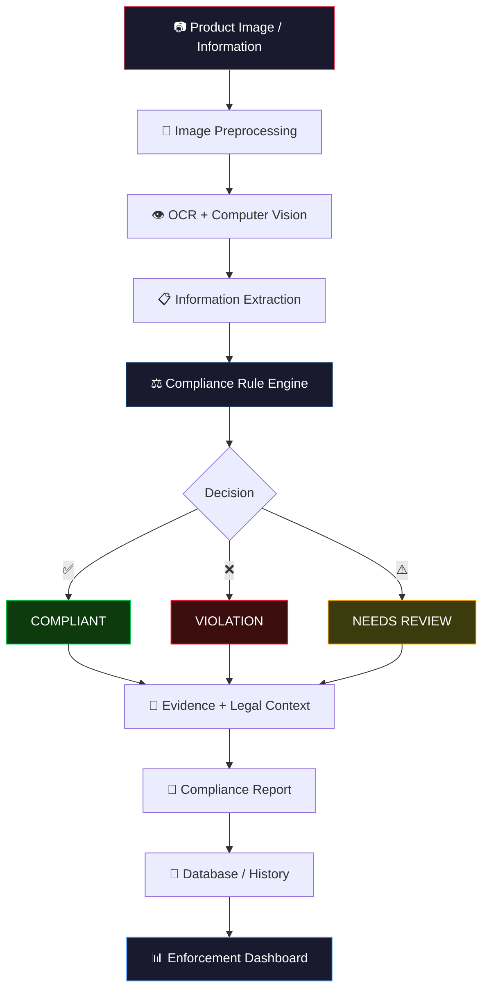

### Core Principle

> **AI extracts and assists → Rules evaluate → RAG explains and references → Human reviews uncertain cases.**

Validra is a **decision-support system**, not a replacement for authorized legal or enforcement judgment. AI/CV outputs are accompanied by confidence information, and uncertain cases are routed for manual review.

---

## 🧠 Why Validra?

<table>
<tr>
<th align="center">❌ Traditional Manual Inspection</th>
<th align="center">✅ Validra — AI-Assisted Inspection</th>
</tr>
<tr>
<td>

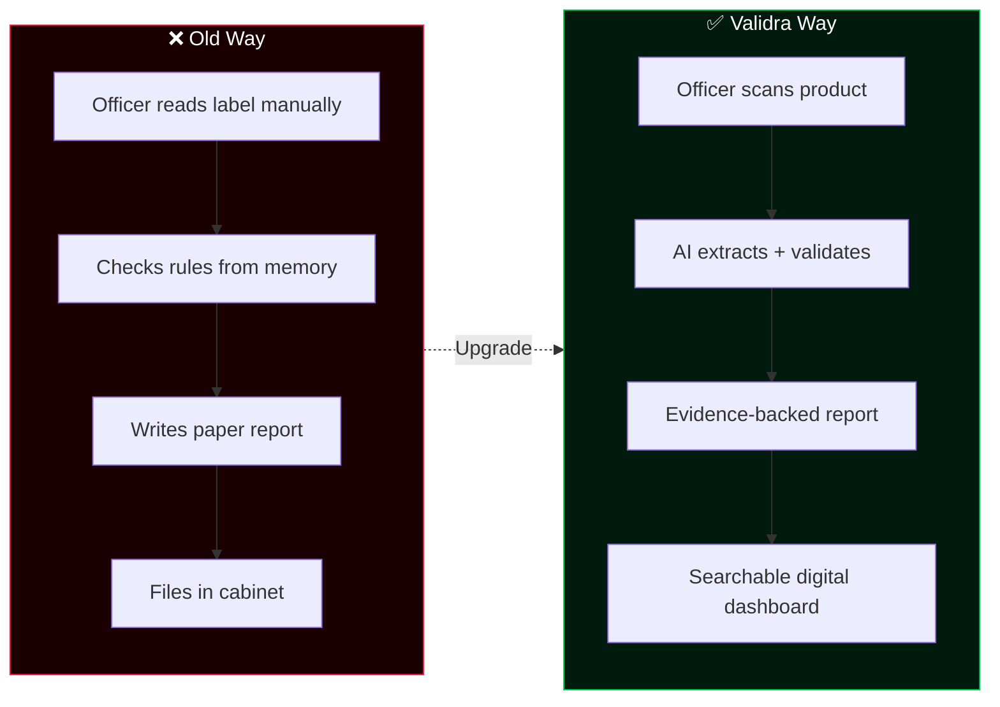

---

## 🚀 Key Features

<table>
<tr>
<td width="50%">

---

## 🏗️ System Design & Architecture

### High-Level System Architecture

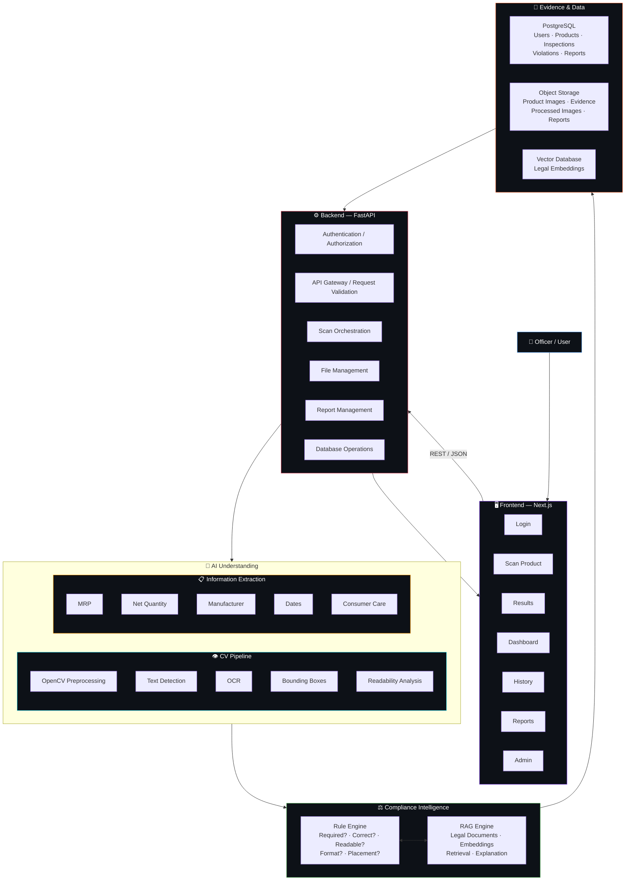

### Five-Layer Architecture

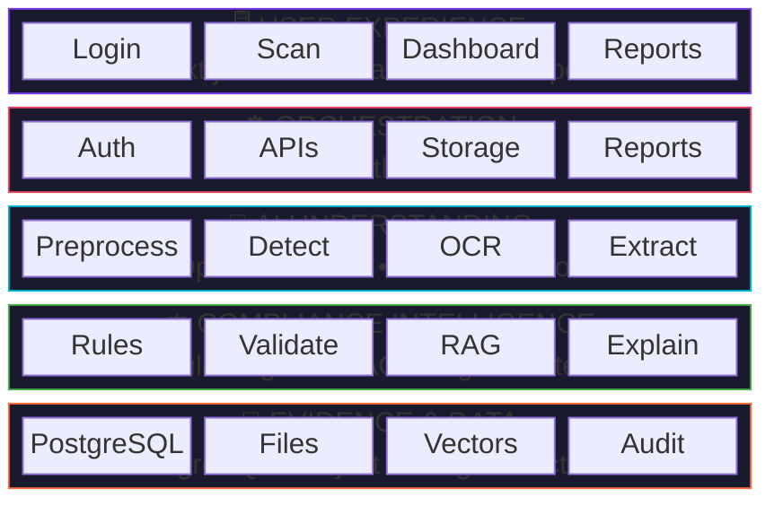

### Complete Inspection Sequence

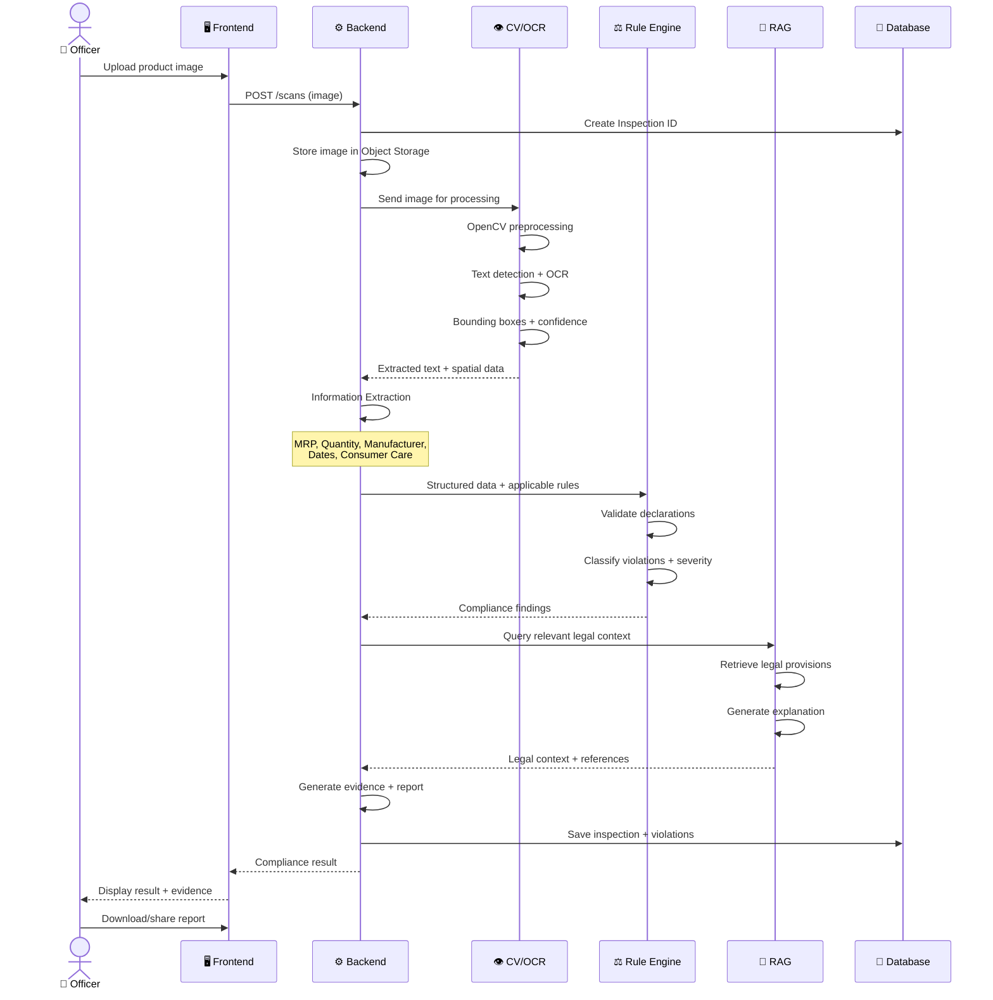

---

## 🔄 Processing Pipeline

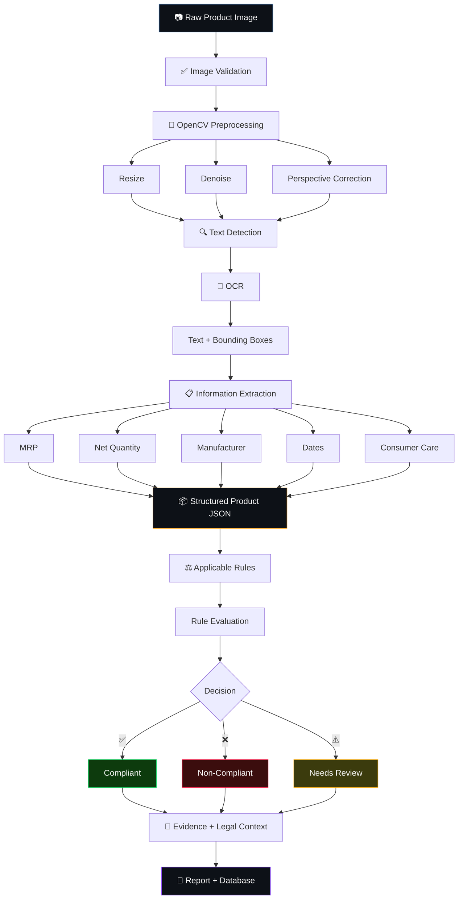

### Example OCR Output

```json
{
  "text": "MRP ₹50",
  "confidence": 0.96,
  "bbox": [120, 340, 280, 390],
  "field": "mrp"
}
```

### Example Extracted Field

```json
{
  "mrp": {
    "value": 50.0,
    "currency": "INR",
    "confidence": 0.96
  },
  "net_quantity": {
    "value": 100,
    "unit": "g",
    "confidence": 0.94
  },
  "manufacturing_date": {
    "value": "06/2026",
    "confidence": 0.91
  }
}
```

---

## ⚖️ Rule Engine + RAG

Validra separates **compliance decisions** from **language generation**. The Rule Engine makes deterministic decisions; RAG provides legal context and explanations.

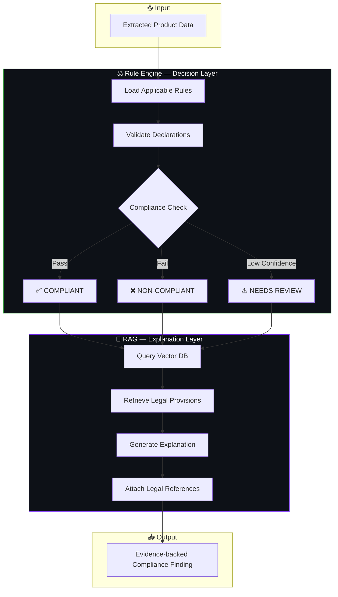

### Example Conceptual Rule

```json
{
  "rule_id": "LM-PC-001",
  "field": "manufacturer",
  "required": true,
  "validation": "must_exist",
  "severity": "high",
  "legal_reference": "Legal Metrology (PC) Rules, 2011",
  "effective_date": "2011-01-01"
}
```

### Rule Engine Decision States

| State                   | Icon | Meaning                       | When Used                                    |
| ----------------------- | ---- | ----------------------------- | -------------------------------------------- |
| **Compliant**     | ✅   | Declaration passes validation | High confidence, rule satisfied              |
| **Non-Compliant** | ❌   | Violation detected            | Declaration missing/invalid, high confidence |
| **Needs Review**  | ⚠️ | Uncertain result              | Low OCR/extraction confidence                |

---

## 📊 Confidence-Aware Inspection

Validra tracks uncertainty throughout the AI pipeline — this prevents **false certainty** and helps officers focus on ambiguous cases.

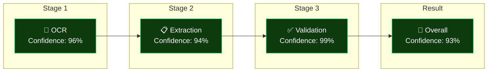

### High vs Low Confidence Examples

<table>
<tr>
<th align="center">✅ High Confidence — Auto Decision</th>
<th align="center">⚠️ Low Confidence — Needs Review</th>
</tr>
<tr>
<td>

---

## 🗃️ Data Model


### Core Tables

| Table                  | Purpose                     | Key Relationships               |
| ---------------------- | --------------------------- | ------------------------------- |
| `users`              | Officer/admin accounts      | Creates inspections             |
| `products`           | Product information         | Inspected via inspections       |
| `inspections`        | Core inspection record      | Links all entities              |
| `images`             | Original + processed images | Belong to inspection            |
| `extracted_fields`   | OCR/extraction results      | Per inspection, with confidence |
| `compliance_results` | Overall compliance status   | One per inspection              |
| `violations`         | Individual violations found | References rules                |
| `rules`              | Legal compliance rules      | Referenced by violations        |
| `reports`            | Generated PDF reports       | One per inspection              |
| `audit_logs`         | Who did what, when          | System-wide tracking            |

---

## 🔌 API Overview

<details>
<summary><strong>📡 Click to expand API endpoints</strong></summary>

<br/>

| Method   | Endpoint              | Purpose                           | Auth Required |
| -------- | --------------------- | --------------------------------- | :-----------: |
| `POST` | `/auth/login`       | Authenticate user                 |      ❌      |
| `POST` | `/auth/register`    | Register new user                 |      ❌      |
| `POST` | `/scans`            | Upload product / start inspection |      ✅      |
| `GET`  | `/scans/{id}`       | Get processing status             |      ✅      |
| `GET`  | `/inspections/{id}` | Retrieve full inspection          |      ✅      |
| `GET`  | `/products`         | Search products                   |      ✅      |
| `GET`  | `/violations`       | Retrieve violations               |      ✅      |
| `GET`  | `/dashboard`        | Dashboard statistics              |      ✅      |
| `POST` | `/reports/{id}`     | Generate report                   |      ✅      |
| `GET`  | `/reports/{id}`     | Download/view report              |      ✅      |

### Example: Start Inspection

**Request:**

```http
POST /scans
Content-Type: multipart/form-data

image = product.jpg
```

**Response:**

```json
{
  "inspection_id": "INS-000124",
  "status": "processing"
}
```

**Poll for result:**

```http
GET /scans/INS-000124
```

```json
{
  "status": "completed",
  "compliance_status": "non_compliant",
  "score": 78,
  "violations": 2
}
```

API contracts are versioned and documented through FastAPI/OpenAPI.

</details>

---

## 🧩 Technology Stack

<table>
<tr>
<th>Layer</th>
<th>Technology</th>
<th>Badge</th>
</tr>
<tr>
<td><strong>Frontend</strong></td>
<td>Next.js, TypeScript</td>
<td> </td>
</tr>
<tr>
<td><strong>UI</strong></td>
<td>Tailwind CSS, shadcn/ui</td>
<td> </td>
</tr>
<tr>
<td><strong>Backend</strong></td>
<td>FastAPI, Python</td>
<td> </td>
</tr>
<tr>
<td><strong>Database</strong></td>
<td>PostgreSQL</td>
<td></td>
</tr>
<tr>
<td><strong>Computer Vision</strong></td>
<td>OpenCV</td>
<td></td>
</tr>
<tr>
<td><strong>OCR</strong></td>
<td>PaddleOCR / selected engine</td>
<td></td>
</tr>
<tr>
<td><strong>ML/NLP</strong></td>
<td>spaCy, scikit-learn</td>
<td></td>
</tr>
<tr>
<td><strong>RAG</strong></td>
<td>Embeddings + Vector DB</td>
<td></td>
</tr>
<tr>
<td><strong>LLM</strong></td>
<td>Configurable provider</td>
<td></td>
</tr>
<tr>
<td><strong>Auth</strong></td>
<td>JWT / configurable</td>
<td></td>
</tr>
<tr>
<td><strong>Reports</strong></td>
<td>ReportLab</td>
<td></td>
</tr>
<tr>
<td><strong>API Protocol</strong></td>
<td>REST / JSON</td>
<td></td>
</tr>
</table>

> Technology choices may evolve based on accuracy, benchmarks, cost, and deployment constraints.

---

## 📁 Repository Structure

```text
validra/
│
├── frontend/                 # Next.js application
│   ├── app/
│   ├── components/
│   ├── lib/
│   └── public/
│
├── backend/                  # FastAPI application
│   ├── app/
│   │   ├── api/              # Route handlers
│   │   ├── core/             # Config, security
│   │   ├── database/         # DB connections
│   │   ├── models/           # SQLAlchemy models
│   │   ├── schemas/          # Pydantic schemas
│   │   └── services/         # Business logic
│   └── requirements.txt
│
├── cv/                       # Computer Vision & OCR
│   ├── preprocessing/
│   ├── detection/
│   ├── ocr/
│   └── extraction/
│
├── rule-engine/              # Compliance rule system
│   ├── rules/
│   ├── validators/
│   ├── evaluators/
│   └── schemas/
│
├── rag/                      # Legal RAG pipeline
│   ├── ingestion/
│   ├── retrieval/
│   ├── embeddings/
│   └── generation/
│
├── research/                 # Legal research, datasets, benchmarks
├── tests/                    # Unit, integration & E2E tests
│
├── docs/                     # 📖 Interactive MDX documentation
│   └── base_setup.mdx        # Beginner-friendly environment setup
│
├── .env.example
├── .gitignore
└── README.md
```

---

## 🧪 Testing Strategy

<details>
<summary><strong>🔬 Click to expand testing details</strong></summary>

<br/>

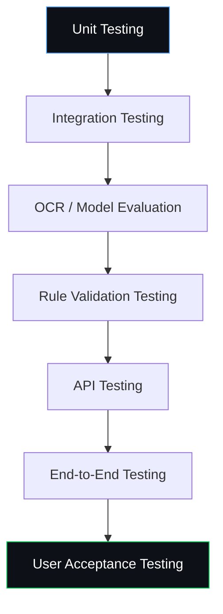

### Test Cases

| Category                | Test Scenario                                      |
| ----------------------- | -------------------------------------------------- |
| **Image Quality** | Clear, blurred, rotated, low-light images          |
| **Declarations**  | Missing, incorrect, partial declarations           |
| **OCR**           | OCR errors, low-confidence extraction              |
| **Rules**         | Multiple categories, conflicting info              |
| **System**        | API failures, unauthorized access, report failures |

### Evaluation Metrics

| Domain                      | Metrics                                                                      |
| --------------------------- | ---------------------------------------------------------------------------- |
| **OCR / Extraction**  | Character Error Rate, Word Error Rate, Field Accuracy, Precision, Recall, F1 |
| **Computer Vision**   | Detection Precision/Recall, IoU                                              |
| **Compliance Engine** | Rule Accuracy, False Positive/Negative Rate, Violation Classification        |
| **System**            | Avg Processing Time, API Latency, Success Rate, Report Gen Time              |

</details>

---

## 🛡️ Responsible AI & Legal Disclaimer

> [!IMPORTANT]
> Validra is an **AI-assisted inspection and decision-support system**.

The system should:

- ✅ Preserve supporting evidence
- ✅ Display confidence levels
- ✅ Provide applicable rule references
- ✅ Flag uncertain cases for manual review
- ❌ **Never** present low-confidence AI outputs as definitive legal conclusions

> Final legal interpretation and enforcement action should remain with the authorized authority.

---

## 🛠️ Development Roadmap


### Detailed Phase Checklist

<details>
<summary><strong>Phase 1 — Foundation</strong></summary>

- [ ] Repository setup
- [ ] Next.js frontend skeleton
- [ ] FastAPI backend skeleton
- [ ] PostgreSQL schema design
- [ ] Authentication system
- [ ] API contracts definition

</details>

<details>
<summary><strong>Phase 2 — Core AI Pipeline</strong></summary>

- [ ] Image upload endpoint
- [ ] OpenCV preprocessing
- [ ] OCR integration
- [ ] Bounding-box extraction
- [ ] Mandatory-field extraction
- [ ] Initial compliance rules (3–5)

</details>

<details>
<summary><strong>Phase 3 — Compliance Intelligence</strong></summary>

- [ ] Rule repository
- [ ] Rule evaluator
- [ ] Violation classification
- [ ] Confidence propagation
- [ ] Evidence localization

</details>

<details>
<summary><strong>Phase 4 — RAG</strong></summary>

- [ ] Legal document ingestion
- [ ] Chunking strategy
- [ ] Embeddings generation
- [ ] Vector search
- [ ] Relevant-rule retrieval
- [ ] Explanation generation

</details>

<details>
<summary><strong>Phase 5 — Productization</strong></summary>

- [ ] Enforcement dashboard
- [ ] Inspection history
- [ ] PDF reports
- [ ] Search and filtering
- [ ] Role-based access
- [ ] Audit logs

</details>

<details>
<summary><strong>Phase 6 — Validation & Deployment</strong></summary>

- [ ] Dataset creation
- [ ] Model benchmarking
- [ ] End-to-end testing
- [ ] Security testing
- [ ] Performance optimization
- [ ] Deployment
- [ ] Documentation
- [ ] SIH demonstration

</details>

---

## 👥 Team Domains

<details>
<summary><strong>👨‍💻 Click to expand team structure</strong></summary>

<br/>

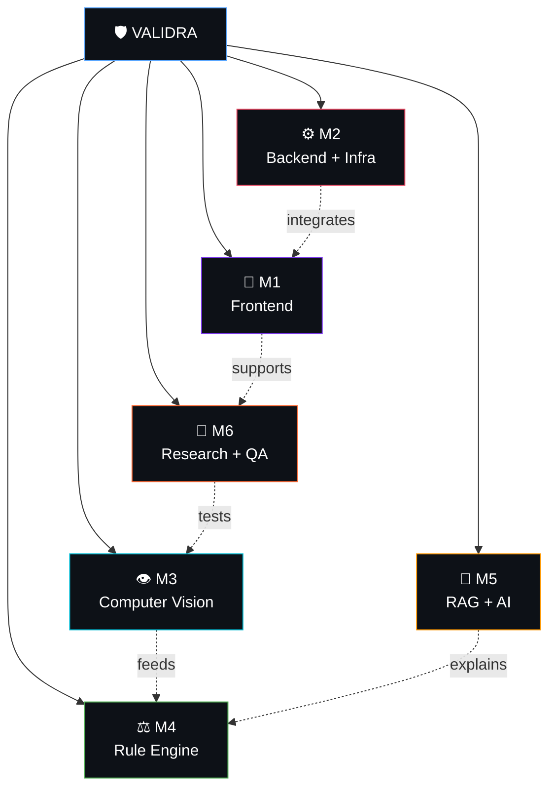

| Domain                                 | Responsibility                                               |
| -------------------------------------- | ------------------------------------------------------------ |
| 🎨**Frontend**                   | Next.js, UI/UX, dashboard, scanning workflow                 |
| ⚙️**Backend & Infrastructure** | FastAPI, APIs, DB, Auth, storage, deployment                 |
| 👁️**Computer Vision**          | OpenCV, OCR, detection, readability analysis                 |
| ⚖️**Rule Engine**              | Legal rules, validation, violations, compliance scoring      |
| 🧠**RAG & AI**                   | Legal retrieval, embeddings, LLM integration                 |
| 🔬**Research & QA**              | Legal research, datasets, evaluation, testing, documentation |

All members contribute to integration, debugging, and final system validation.

</details>

---

## 🤝 Contribution Workflow

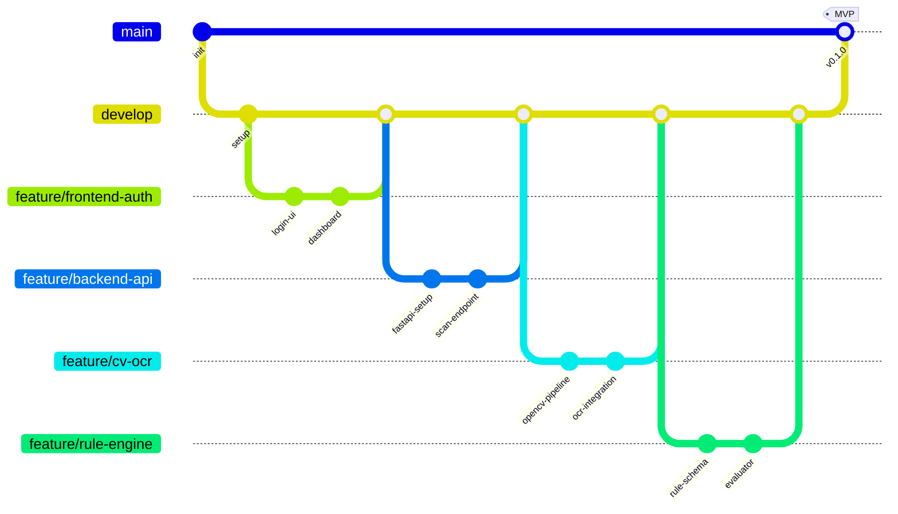

### PR Guidelines

Before opening a pull request:

- ✅ Keep changes focused and small
- ✅ Test locally before pushing
- ✅ Update documentation when required
- ❌ Never commit secrets or `.env` files
- ✅ Add/update tests for important functionality
- ✅ Explain what changed and why in the PR description

---

## 🚀 Getting Started

### Prerequisites

| Tool       | Version | Purpose          |
| ---------- | ------- | ---------------- |
| Git        | Latest  | Version control  |
| Node.js    | 18+ LTS | Frontend runtime |
| Python     | 3.10+   | Backend + AI     |
| PostgreSQL | 15+     | Database         |

> 📖 **New to development?** Check our [Base Setup Guide](./docs/base_setup.mdx) for step-by-step installation instructions starting from scratch!

### Clone

```bash
git clone https://github.com/dhruvpatel16120/Validra.git
cd validra
```

### Frontend

```bash
cd frontend
npm install
npm run dev
```

### Backend

```bash
cd backend
python -m venv .venv

# Linux/macOS
source .venv/bin/activate

# Windows
.venv\Scripts\activate

pip install -r requirements.txt
uvicorn app.main:app --reload
```

> [!WARNING]
> Create your local `.env` from `.env.example`. **Never commit** API keys, passwords, or private credentials.

---

## 📖 Interactive Documentation

Validra uses **MDX** (Markdown + JSX) for interactive, component-rich documentation with embedded **Mermaid diagrams** for visual system explanations.

| Document                                        | Description                                                          |     Status     |
| ----------------------------------------------- | -------------------------------------------------------------------- | :------------: |
| [`docs/base_setup.mdx`](./docs/base_setup.mdx) | 🟢 Base environment setup guide (Git, IDE, Node, Python, PostgreSQL) |  ✅ Available  |
| `docs/frontend_setup.mdx`                     | 🔵 Frontend development environment setup                            | 🔜 Coming Soon |
| `docs/backend_setup.mdx`                      | 🟣 Backend development environment setup                             | 🔜 Coming Soon |
| `docs/architecture.md`                        | System architecture deep-dive                                        |   🔜 Planned   |
| `docs/api.md`                                 | API documentation                                                    |   🔜 Planned   |
| `docs/database.md`                            | Database schema & migrations                                         |   🔜 Planned   |
| `docs/cv-pipeline.md`                         | CV/OCR pipeline documentation                                        |   🔜 Planned   |
| `docs/rule-engine.md`                         | Rule engine documentation                                            |   🔜 Planned   |
| `docs/rag.md`                                 | RAG pipeline documentation                                           |   🔜 Planned   |
| `docs/testing.md`                             | Testing strategy & guidelines                                        |   🔜 Planned   |

### Why MDX + Mermaid?

- 📊 **Mermaid Diagrams** — Flowcharts, sequence diagrams, ER diagrams, and more rendered directly in documentation
- ⚛️ **MDX Components** — Interactive callouts, tabs, steps, and code blocks
- 🔄 **Version Controlled** — Documentation lives with the code
- 🎨 **Beautiful Rendering** — Rich formatting with syntax highlighting

---

## 🏆 Smart India Hackathon 2026

<table>
<tr>
<td><strong>Problem Statement</strong></td>
<td>26034</td>
</tr>
<tr>
<td><strong>Organization</strong></td>
<td>Ministry of Consumer Affairs, Food & Public Distribution</td>
</tr>
<tr>
<td><strong>Department</strong></td>
<td>Department of Consumer Affairs (DoCA)</td>
</tr>
<tr>
<td><strong>Category</strong></td>
<td>Software</td>
</tr>
<tr>
<td><strong>Theme</strong></td>
<td>Miscellaneous</td>
</tr>
<tr>
<td><strong>Project</strong></td>
<td><strong>Validra — Intelligent Product Compliance</strong></td>
</tr>
</table>

---

## 📌 Status

<div align="center">

---

## 📄 License

License to be finalized by the project team based on Smart India Hackathon submission requirements and future project plans.

---

<div align="center">
