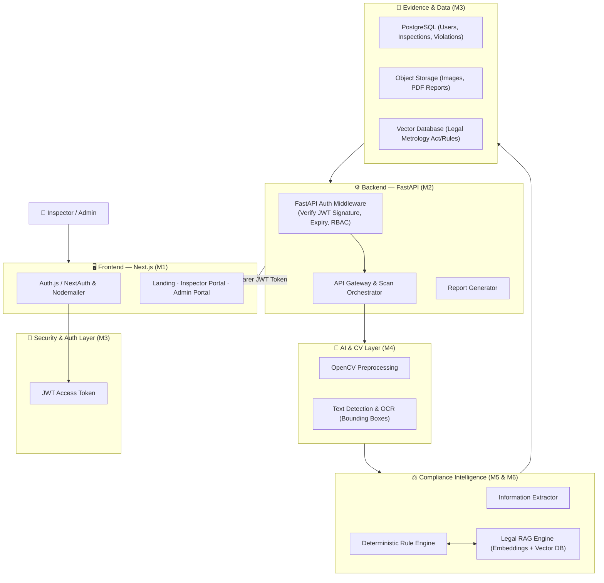
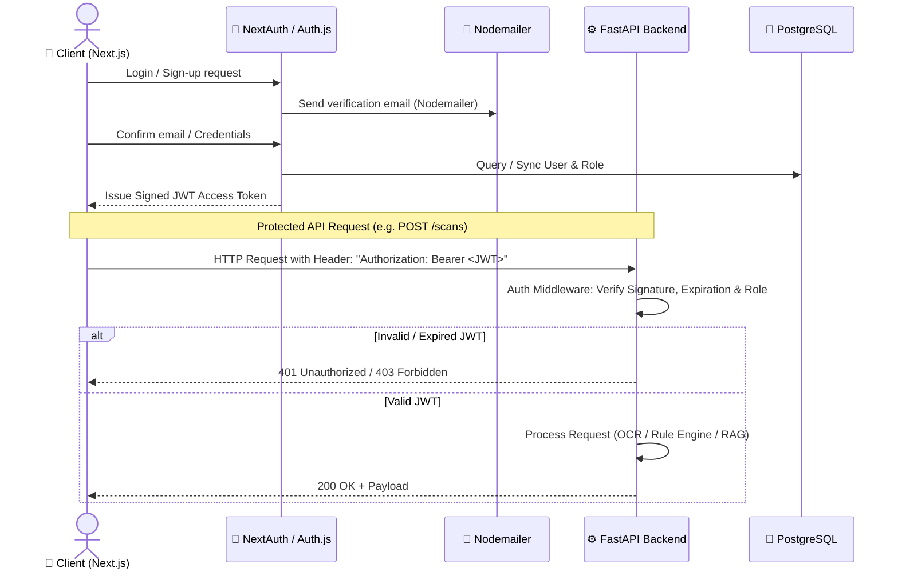
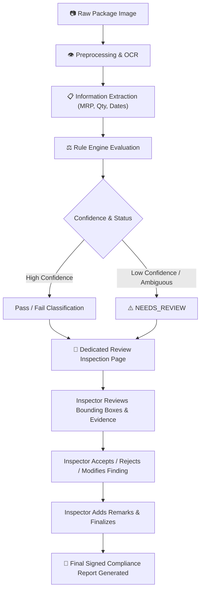

# Validra — System Architecture Specification

## 1. High-Level System Architecture

Validra uses a decoupled architecture separating Frontend User Experience (Next.js), Backend Orchestration (FastAPI), AI/CV Processing (OpenCV/OCR), Compliance Engine (Deterministic Rules + RAG), and Data Persistence (PostgreSQL, Object Storage, Vector Store).

---

## 2. Authentication & Authorization Security Flow

### Critical Security Rule

FastAPI **never** trusts a simple `isAuthorized: true` flag from Next.js endpoints. FastAPI independently decodes and validates the JWT signature, expiration, and user permissions before granting access to OCR, Rule Engine, or DB services.

---

## 3. Dedicated Review Inspection Architecture

Validra enforces human-in-the-loop validation for compliance inspection findings:

---

## 4. Five-Layer System Architecture

1. **User Experience Layer (M1)**: Next.js App Router, Tailwind CSS, shadcn/ui, responsive portal layouts.
2. **Orchestration & Gateway Layer (M2)**: FastAPI, Pydantic data schemas, async task pipelines, REST endpoints.
3. **Database, Auth & Integration Layer (M3)**: NextAuth + Nodemailer authentication, JWT token validation, PostgreSQL relational models, Object Storage.
4. **AI & Computer Vision Layer (M4)**: OpenCV image enhancement, OCR text detection, bounding-box coordinate tracking.
5. **Compliance & Legal Intelligence Layer (M5 & M6)**: Deterministic Rule Engine, structured Information Extraction, RAG Vector Search with Legal Metrology citation generation.
