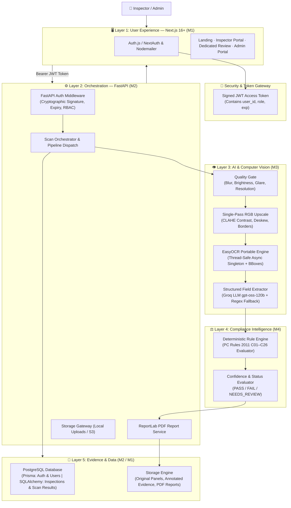
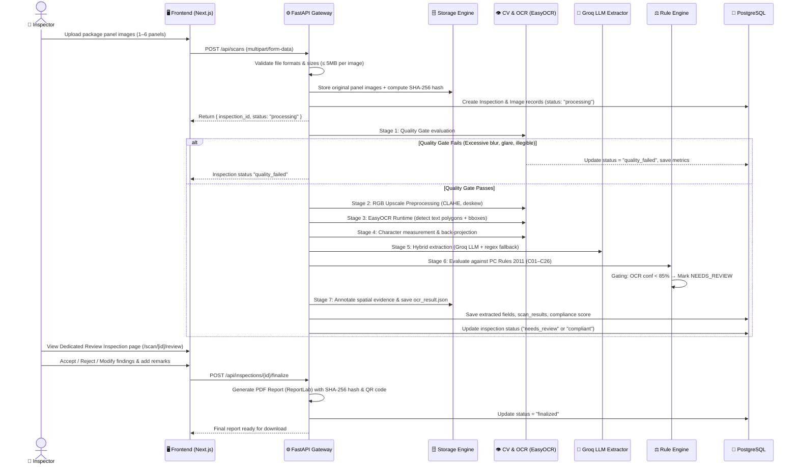

# Validra — System Architecture Specification

> **Single Source of Truth Reference:** Derived from [`docs/blueprints/`](./blueprints/) (`blueprint.md`, `backend-blueprint.md`, `schema-blueprint.md`).

---

## 1. System Overview & Core Principle

**Validra** is an AI-assisted packaged commodity compliance checking system designed to inspect packaged goods against requirements under India's **Legal Metrology Act, 2009** and **Legal Metrology (Packaged Commodities) Rules, 2011**.

### Core Architecture Principle

> **AI extracts and assists → Rules evaluate deterministically → Human reviews uncertain cases.**

Validra is a decision-support system, not an autonomous replacement for authorized legal judgment. Compliance decisions are evaluated deterministically by the Rule Engine, never hallucinated by an LLM.

### End-to-End Core Pipeline

```
Image → Quality Gate → Preprocessing → OCR → Field Extraction → Rule Engine → Evidence Generation → Report Generation → Dedicated Review
```

---

## 2. Five-Layer System Architecture

```
┌────────────────────────────────────────────────────────────────────────┐
│  Layer 1 — USER EXPERIENCE (Next.js 16+ App Router)                   │
│  Landing Pages · Scan Interface · Dedicated Review · Reports · Admin  │
├────────────────────────────────────────────────────────────────────────┤
│  Layer 2 — ORCHESTRATION & GATEWAY (FastAPI)                          │
│  Auth Middleware · REST APIs · Async Pipeline Dispatch · Storage      │
├────────────────────────────────────────────────────────────────────────┤
│  Layer 3 — AI UNDERSTANDING & COMPUTER VISION                         │
│  Quality Gate · RGB Preprocess · EasyOCR Engine · Groq LLM Extraction │
├────────────────────────────────────────────────────────────────────────┤
│  Layer 4 — COMPLIANCE INTELLIGENCE                                    │
│  Deterministic Rule Engine · Legal References · Confidence Gating     │
├────────────────────────────────────────────────────────────────────────┤
│  Layer 5 — EVIDENCE & DATA                                            │
│  PostgreSQL (Dual ORM: Prisma + SQLAlchemy) · Local & Object Storage  │
└────────────────────────────────────────────────────────────────────────┘
```

### High-Level Architecture Flow



---

## 3. Scan Orchestration Pipeline & Lifecycle

When an inspector uploads multi-panel packaging images, the backend orchestrates the multi-stage pipeline:



### Inspection Status Lifecycle

| Status | Trigger / Condition | Allowed Next Actions |
|---|---|---|
| `pending` | Record created, image queued | Awaiting pipeline pickup |
| `processing` | Pipeline actively running OCR & rule evaluation | Poll status via `GET /api/scans/{id}` |
| `quality_failed` | Blur score / glare / resolution below threshold | Retry scan with clearer image |
| `compliant` | All mandatory rules pass with high confidence (≥ 85%) | Inspector reviews & finalizes |
| `flagged` | Clear statutory violation detected by Rule Engine | Inspector reviews violation & finalizes report |
| `needs_review` | Low confidence (< 85%), ambiguous unit, or missing mandatory field | Mandatory human review on Dedicated Review page |
| `finalized` | Inspector accepted/modified findings, added remarks, signed off | Download court-admissible PDF report, immutable audit trail |

---

## 4. Authentication, Authorization & Security Architecture

### Authentication & Token Issuance Flow

```mermaid
sequenceDiagram
    actor Officer as 👤 Inspector
    actor Admin as 👑 Administrator
    participant FE as 🖥️ Next.js Frontend
    participant Mail as 📧 Nodemailer
    participant DB as 💾 PostgreSQL (Prisma)
    participant BE as ⚙️ FastAPI Backend

    rect rgb(20, 25, 35)
    Note over Officer, DB: Inspector Onboarding Flow
    Officer->>FE: Register at /register
    FE->>DB: Create User (isActive: false, isVerified: false)
    FE->>Mail: Send email verification link
    Officer->>FE: Click verification link (/verify-email?token=...)
    FE->>DB: Mark isVerified = true
    Officer->>FE: Attempt login → redirected to /pending-approval
    Admin->>FE: Approve inspector in /admin/users or via CLI (npm run inspector:approve)
    FE->>DB: Mark isActive = true
    end

    rect rgb(25, 20, 35)
    Note over Officer, BE: Authenticated Session & API Execution
    Officer->>FE: Submit credentials at /login
    FE->>DB: Verify bcrypt password & active status
    FE-->>Officer: Set NextAuth session cookie
    FE->>FE: Request /api/auth/token → mint signed HS256 Bearer JWT
    Officer->>BE: HTTP Request (e.g. POST /api/scans) + "Authorization: Bearer <JWT>"
    BE->>BE: FastAPI Auth Middleware: verify signature, expiration & RBAC
    BE-->>Officer: 200 OK + payload
    end
```



### Security Principles & Rules

1. **Independent Backend Authorization**: FastAPI **never** trusts a frontend client-side authorization flag (`isAuthorized: true`). Every protected API endpoint independently validates the cryptographic JWT signature, expiration, and role permissions.
2. **Admin Provisioning**: Administrative accounts are **never created via public registration**. Admin users are provisioned exclusively through secure CLI scripts (`npm run admin:create`).
3. **Role-Based Access Control (RBAC)**:
   - `INSPECTOR`: Upload scans, view assigned inspections, review findings, finalize inspections, download reports.
   - `ADMIN`: User management, inspector account approvals, rule management (CRUD), audit logs, system configuration.
4. **Zero Hardcoded Secrets**: Secrets, DB connection strings, and JWT signing keys are managed strictly via environment variables (`.env`).
5. **Tamper-Evidence & Integrity**: SHA-256 hashes are computed for both raw uploaded images and finalized PDF reports.

---

## 5. Dedicated Review Inspection Architecture

Validra enforces a **human-in-the-loop** inspection review architecture to guarantee legal accountability:

```
┌────────────────────────────────────────────────────────────────────────┐
│ VALIDRA Inspector Portal — Inspection Review (#INS-000124)             │
├──────────────────────────────────────┬─────────────────────────────────┤
│ 📷 Product Package Evidence          │ 📋 Rule Engine Findings & Evid. │
│                                      │                                 │
│ ┌──────────────────────────────────┐ │ MRP: ₹99.00 (Inclusive of taxes)│
│ │ [BBox 1: MRP]                    │ │ Status: ✅ PASS                 │
│ │ [BBox 2: Net Qty]                │ │ Confidence: 97%                 │
│ │ [BBox 3: Mfg Date]               │ │ Rule: Rule 6(1)(e)              │
│ └──────────────────────────────────┘ │                                 │
│ Zoom: [ + ] [ - ] [ Reset ]          │ Net Quantity: 500 g             │
│ Toggle Bounding Boxes: [ ON ]        │ Status: ⚠️ NEEDS REVIEW          │
│ Highlight: [ MRP ] [ Qty ] [ Mfg ]   │ Confidence: 64%                 │
│                                      │ Rule: Rule 6(1)(a)              │
├──────────────────────────────────────┴─────────────────────────────────┤
│ Inspector Decision per Finding:                                        │
│ [ Accept ]    [ Modify Value / Status ]    [ Reject Violation ]        │
│                                                                        │
│ Inspector Remarks: [ Verified unit matches physical retail carton    ] │
│                                                                        │
│ [ 📄 Finalize & Generate Signed PDF Report ]                           │
└────────────────────────────────────────────────────────────────────────┘
```

1. **Spatial Evidence Localization**: EasyOCR bounding boxes (`[x1, y1, x2, y2]`) and 4-point polygons are mapped directly to interactive overlays on the package photo.
2. **Confidence-Aware Flagging**: Findings with OCR confidence `< 85%` or ambiguous text formatting are flagged as `NEEDS_REVIEW`.
3. **Audit Trail Logging**: Any modification made by the inspector (overriding a status, editing a detected value) is recorded in the `audit_logs` table with inspector ID, timestamp, and previous vs new value.

---

## 6. Database & Storage Architecture (Dual-ORM Strategy)

Validra uses **two ORMs** accessing the **same PostgreSQL database**:

| ORM | Layer | Scope & Entities |
|---|---|---|
| **Prisma** | Frontend / NextAuth | `users` (CUID, credentials, approval & verification flags), `audit_logs` (tamper-evident audit trail) |
| **SQLAlchemy 2.0 (async)** | Backend / FastAPI | `users`, `inspections`, `images`, `scan_results`, `rules`, `reports`, `audit_logs` |

### Relational Entity Model

```
users (Prisma / NextAuth & SQLAlchemy)
  │ 1:N
  ▼
inspections (SQLAlchemy)
  │ 1:N
  ├── images (multi-panel uploads: front, back, sides, top, bottom)
  ├── scan_results (individual rule evaluation outcomes) ────── N:1 ────── rules (C01–C26)
  └── reports (ReportLab PDF certificates & verification hashes)

audit_logs (Shared between Prisma and SQLAlchemy)
```

### Storage Strategy

| Data Asset | Storage Medium | Justification |
|---|---|---|
| Relational Entities & Metadata | PostgreSQL 15+ | Relational integrity, foreign keys, ACID compliance |
| Raw OCR JSON & Quality Metrics | Local JSON (`ocr_result.json`) & PostgreSQL | Fast reprocessing, provenance auditing without re-running OCR |
| Uploaded Panel Images | Filesystem (`uploads/scans/{scan_id}/`) / S3 | High-res binaries served directly via static `/uploads` route |
| Annotated Evidence Images | Filesystem (`uploads/scans/{scan_id}/annotated.jpg`) | Immediate visual verification in review UI |
| Final PDF Reports | Filesystem (`uploads/reports/`) / S3 | Court-admissible statutory audit certificates |


---

## 7. PDF Report Generation Architecture

Compliance reports are generated using **ReportLab Platypus** with an evidentiary structure:

1. **Cover Section**: Validra emblem, Report Code (`VAL-YYYY-XXXXX`), Inspection Timestamp, Officer details, Product Overview, Overall Compliance Status Badge, Compliance Score Ring.
2. **Executive Summary**: Tabular breakdown of mandatory declarations (Field, Detected Value, Confidence %, Compliance Status, Rule Reference).
3. **Image Quality Metrics**: Blur score, glare ratio, brightness, resolution, and text presence audit.
4. **Detailed Evidentiary Findings**: Side-by-side cropped bounding boxes highlighting detected text regions on the actual package surface.
5. **Integrity & Tamper Evidence Footer**:
   - SHA-256 hash of original image.
   - SHA-256 hash of final PDF document.
   - Verification QR Code resolving to `https://validra.app/verify/{report_code}` for downstream authenticity checks.
