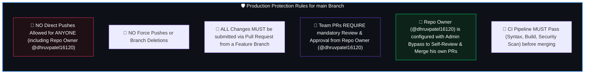

# 🛡️ Validra CI/CD & Production Workflow Automation

<p align="center">
  <a href="../README.md">
    
  </a>
</p>

This document provides a complete overview of the CI/CD pipelines, branch protection rules, GitHub Actions automations, and domain workflows configured for **Validra** by **Team VisionMinds — Think. Build. Transform.**.

---

## 🎯 Production Ruleset & Owner Enforcements (`main` Branch)

The **`main` branch** is designated as our **production deployment branch** and is protected under strict rulesets:



---

## 👨‍💻 Workflow 1: Team Member Contribution (M1–M6)

1. **Pick or Raise an Issue**: Use GitHub Issue templates (`bug_report.yml`, `feature_request.yml`, `rule_addition.yml`, `qa_test_task.yml`).
2. **Create a Feature Branch**:
   ```bash
   git checkout main
   git pull origin main
   git checkout -b feature/m1-camera-scanner-ui
   ```
3. **Write Code in Assigned Directory Only**:
   - `frontend/` (M1)
   - `backend/` (M2)
   - `cv/` (M3)
   - `rule-engine/` (M4)
   - `rag/` (M5)
   - `research/` / `tests/` / `docs/` (M6)
4. **Push Branch & Open PR to `main`**:
   ```bash
   git push origin feature/m1-camera-scanner-ui
   ```
5. **Link Issue in PR Description**:
   ```markdown
   Closes #42
   ```
6. **Automated GitHub Action Triggers**:
   - 🏷️ Auto-adds labels (`frontend`, `M1`) based on modified paths.
   - 👤 Auto-assigns `@dhruvpatel16120` as the mandatory reviewer.
   - 🧪 Runs CI Pipeline (`.github/workflows/ci.yml`).
7. **Owner Review & Merge**:
   - `@dhruvpatel16120` reviews code diff and approves PR.
   - Upon merge, **GitHub automatically closes Issue #42**!

---

## 👑 Workflow 2: Repository Owner Workflow (@dhruvpatel16120)

When the Repository Owner wants to add new features or fix code:

1. **Create Feature Branch** (Direct push to `main` is blocked to protect production):
   ```bash
   git checkout main
   git pull origin main
   git checkout -b feature/m2-fastapi-auth-service
   ```
2. **Push Branch & Open PR to `main`**:
   ```bash
   git push origin feature/m2-fastapi-auth-service
   ```
3. **Link Issue in PR Description**:
   ```markdown
   Closes #15
   ```
4. **Self-Review & Merge**:
   - Owner checks CI test results.
   - Owner approves/bypasses PR review requirement via Admin Role configuration.
   - Owner merges PR into `main`.
   - **GitHub automatically closes Issue #15**!

---

## ⚙️ GitHub Actions CI/CD Workflows (`.github/workflows/`)

### 1. `ci.yml` — Automated Testing & Security Scan
- **Linting & Syntax Validation**: Validates all YAML workflows and JSON schemas.
- **Frontend Check (M1)**: Runs Node.js dependency check and Next.js build verification.
- **Backend & AI Check (M2–M5)**: Installs Python dependencies and runs `pytest` test suite.
- **Security Secret Scan**: Scans codebase for accidental API keys, tokens, or private secrets.

### 2. `auto_label_assign_and_close.yml` — Workflow Automation
- **Auto-Assign Issue**: Assigns `@dhruvpatel16120` to all newly opened issues and adds `triage` label.
- **Auto-Assign Reviewer**: Automatically requests review from `@dhruvpatel16120` on team PRs.
- **Auto-Label PRs**: Labels PRs with domain tags (`M1`–`M6`) based on modified directories.
- **Merge Notification & Issue Resolution**: Comments on merged PRs confirming successful integration and automatic issue resolution (`Closes #XX`).

---

## 🔑 Key Keywords for Automatic Issue Closure

Include any of these in your PR body:
- `Closes #123`
- `Fixes #123`
- `Resolves #123`
- `Close #123`
- `Fix #123`
- `Resolve #123`

When the PR is merged into `main`, GitHub natively closes issue `#123` and moves it to `Done`.
