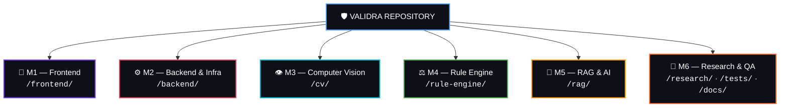
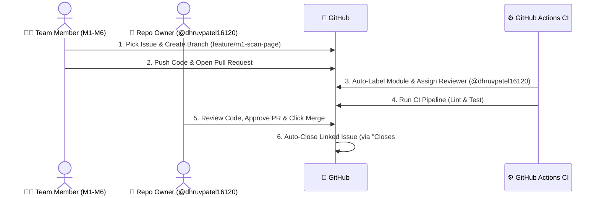

# 🤝 Validra End-to-End Team Collaboration & Automated Workflow Guide

<p align="center">
  <a href="../README.md">
    
  </a>
</p>

This document defines the complete end-to-end environment setup for **Team VisionMinds — Think. Build. Transform.** (Validra). It ensures that team members work independently on designated modules, issues are automatically tracked and closed, and all pull requests require review by **Repository Owner (@dhruvpatel16120)**, while giving the owner full capability to self-review and merge their own feature branches into `main`.

---

## 🏗️ 1. Team Domain & Module Directory Boundaries

Each team member is assigned primary ownership over a specific module directory:



| Domain | Responsibility | Directory Path | GitHub Labels |
|:---:|:---|:---|:---:|
| **M1** | 🎨 **Frontend & UI/UX** | `/frontend/` | `frontend`, `M1` |
| **M2** | ⚙️ **Backend, APIs & DB** | `/backend/`, `.env.example` | `backend`, `M2`, `db` |
| **M3** | 👁️ **Computer Vision & OCR** | `/cv/` | `cv`, `M3` |
| **M4** | ⚖️ **Rule Engine Evaluator** | `/rule-engine/` | `rule-engine`, `M4` |
| **M5** | 🧠 **RAG & Legal Intelligence** | `/rag/` | `rag`, `M5` |
| **M6** | 🔬 **Research, QA & Docs** | `/research/`, `/tests/`, `/docs/` | `qa`, `M6` |

---

## 🔄 2. End-to-End Automated Workflow Overview



---

## 👨‍💻 3. Team Member Workflow (Step-by-Step)

### Step 1: Create or Pick an Issue
1. Go to **Issues** ➔ Select an Issue (e.g. `#42 Add camera scanning UI`).
2. Assign yourself to the issue.

### Step 2: Create a Feature Branch from `develop` or `main`
```bash
# Branch Naming Pattern: <type>/<domain>-<short-description>
git checkout main
git pull origin main
git checkout -b feature/m1-camera-scanner-ui
```

### Step 3: Write Code in Your Assigned Directory Only
- M1 team members write inside `frontend/`
- M2 team members write inside `backend/`
- M3 team members write inside `cv/`
- M4 team members write inside `rule-engine/`
- M5 team members write inside `rag/`
- M6 team members write inside `research/`, `tests/`, or `docs/`

### Step 4: Open Pull Request to `main`
1. Push your branch: `git push origin feature/m1-camera-scanner-ui`
2. Open Pull Request on GitHub.
3. **CRITICAL FOR AUTOMATIC ISSUE CLOSING:** In the PR description, write:
   ```markdown
   Closes #42
   ```
   *(Or `Fixes #42` / `Resolves #42`)*

### Step 5: Automatic Processing
- 🏷️ **GitHub Actions** will automatically label your PR (`frontend`, `M1`) based on modified directories.
- 👤 **GitHub Actions** will automatically assign **@dhruvpatel16120** as the reviewer.
- 🧪 **CI Pipeline** will run automated tests.

---

## 👑 4. Repo Owner Workflow (@dhruvpatel16120)

As the Repository Owner, you have two roles:

### Role A: Reviewing & Merging Team Pull Requests
1. Receive notification for new PR opened by a team member.
2. Review code diff, visual evidence, and CI status.
3. Click **Approve** ➔ Click **Squash and merge** (or **Merge pull request**).
4. 🎉 **GitHub will automatically close the linked issue** (e.g. `#42`) upon merge!

---

### Role B: Working on Your Own Feature Branches & Merging to `main`
When YOU create an issue and build a feature on your own branch:

```bash
# 1. Create your branch
git checkout main
git pull origin main
git checkout -b feature/m2-fastapi-auth-system

# 2. Push & open PR
git push origin feature/m2-fastapi-auth-system
```

1. Open PR from `feature/m2-fastapi-auth-system` to `main`.
2. Include `Closes #15` in the PR description.
3. Because Ruleset Bypass is enabled for **RepositoryAdmin**, you can:
   - Click **Merge pull request** directly.
   - Or self-review and merge without requiring another team member's approval!
4. 🎉 Linked Issue `#15` automatically closes upon merge.

---

## ⚙️ 5. One-Time GitHub Settings Configuration

To ensure seamless execution, verify these settings in GitHub Web UI (**Settings**):

### 1. Enable Automatic Issue Closing
- Go to **Settings** ➔ **General** ➔ Under **Pull Requests**:
  - ✅ Ensure **"Automatically close issues when pull requests are merged"** is turned **ON** (Enabled by default in GitHub).

### 2. Configure Branch Protection Ruleset Bypass for Owner
- Go to **Settings** ➔ **Rules** ➔ **Rulesets** ➔ Click `Production Protection — main`:
  - Under **Bypass list**, add:
    - **Actor**: `Repository admin` (or your user account `@dhruvpatel16120`)
    - **Bypass mode**: `Always`
  - Under **Pull request** rule parameters:
    - Set **Required approving review count**: `1`
    - Check **Require review from Code Owners**
    - Uncheck **Require last push approval** (allows owner to merge their own push)

---

## 📊 6. Setting Up Automated GitHub Project Board (v2)

To give your team a visual Kanban board (like Trello/Jira):

1. Go to repository top bar ➔ Click **Projects** ➔ **New project**.
2. Select **Board** layout ➔ Name it **"Validra Sprint Board"**.
3. Click **Workflows** (top right icon on Project board):
   - **Item added to project**: Set status to `Todo`.
   - **Item reopened**: Set status to `Todo`.
   - **Code review requested**: Set status to `In Review`.
   - **Pull request merged**: Set status to `Done` (Auto-moves!).
   - **Item closed**: Set status to `Done` (Auto-moves!).

---

## 🎯 Summary Checklist

| Action | Who | How It Happens | Result |
|:---|:---:|:---|:---|
| **Create Issue** | Anyone | GitHub Issue Templates | Issue tracked in project board |
| **Branch & Code** | Team Member | Code in assigned directory | Clear module boundaries |
| **Open PR** | Team Member | Include `Closes #XX` | Auto-labeled & assigned to `@dhruvpatel16120` |
| **Run CI Tests** | GitHub Actions | `.github/workflows/ci.yml` | Validates build & test suite |
| **Review & Merge** | Repo Owner | Approval / Admin Bypass | Merges code to `main` |
| **Close Issue** | GitHub Native | Triggered by `Closes #XX` | **Issue automatically closed!** 🎉 |
