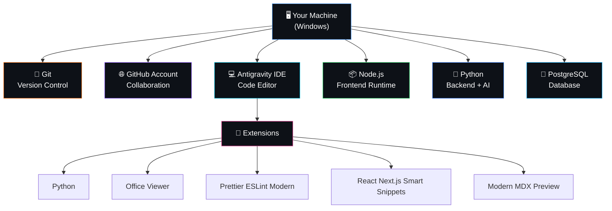
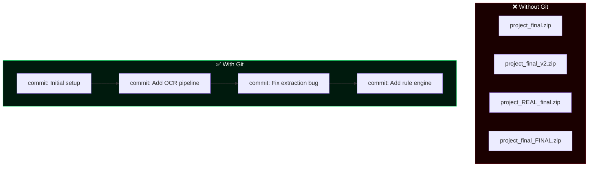
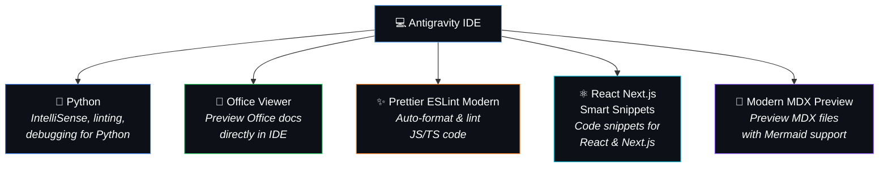
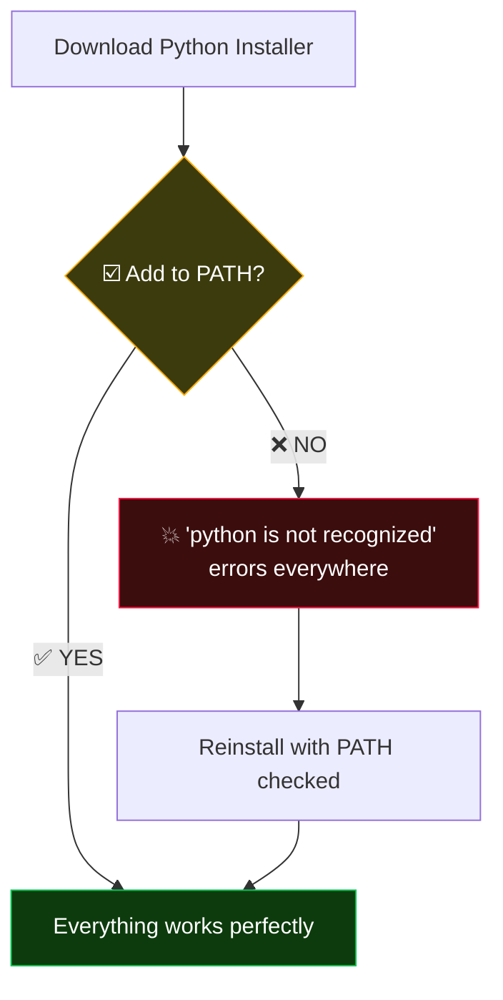
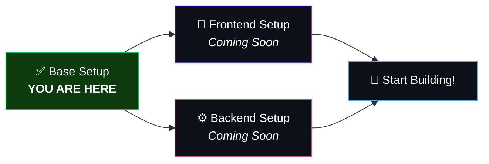

# 🛠️ Validra — Base Environment Setup Guide

> **Starting from scratch?** This guide walks you through installing every tool you need to start contributing to Validra. No prior setup assumed.

---

## 📋 What You'll Install



---

## ✅ Prerequisites Checklist

Before you begin, make sure you have:

- [ ] A Windows 10/11 computer
- [ ] Administrator access on your machine
- [ ] A stable internet connection
- [ ] At least **10 GB** of free disk space

> [!TIP]
> **Complete beginner?** Don't worry — every step includes the exact buttons to click, commands to run, and how to verify everything works.

---

## 📖 Table of Contents

1. [GitHub Account Setup](#1--github-account-setup)
2. [Git Installation](#2--git-installation)
3. [Antigravity IDE Installation](#3--antigravity-ide-installation)
4. [Antigravity Extensions](#4--antigravity-extensions)
5. [Node.js Installation](#5--nodejs-installation)
6. [Python Installation](#6--python-installation)
7. [PostgreSQL Installation](#7--postgresql-installation)
8. [Verify Everything](#8--verify-everything)
9. [Clone the Validra Repository](#9--clone-the-validra-repository)
10. [What's Next?](#10--whats-next)

---

## 1. 🌐 GitHub Account Setup

GitHub is where Validra's code lives. Every team member needs an account.

### Why GitHub?


### Step-by-Step

1. **Go to** [https://github.com](https://github.com)
2. **Click** `Sign up` (top right corner)
3. **Enter** your email address
4. **Create** a password (strong — at least 15 characters or 8 with a number and lowercase letter)
5. **Choose** a username (e.g., `yourname-dev`)
6. **Verify** your email through the confirmation link GitHub sends
7. **Complete** the onboarding questions (you can skip personalization)

### 🎥 Video Tutorial

> **Watch:** [How to Create a GitHub Account (2025)](https://www.youtube.com/watch?v=QUtk-Uuq9nE) — A beginner-friendly walkthrough showing the complete GitHub signup process.

### Configure Your Profile

After creating your account:

1. Click your **profile icon** (top right) → **Settings**
2. Add a **profile picture** — helps your team recognize you
3. Add your **name** and **bio**
4. Set your profile to **public** so team members can find you

> [!IMPORTANT]
> **Share your GitHub username** with the project lead so you can be added as a collaborator to the Validra repository.

---

## 2. 🔧 Git Installation

Git is the version control system that tracks all code changes. It's the backbone of team collaboration.

### What is Git?



### Step-by-Step

1. **Go to** [https://git-scm.com/downloads/win](https://git-scm.com/downloads/win)
2. **Click** `Click here to download` — it auto-detects your system (64-bit)
3. **Run** the downloaded `.exe` file
4. **Follow the installer:**
   - ✅ Accept the license
   - ✅ Keep the default installation path (`C:\Program Files\Git`)
   - ✅ Leave all component checkboxes as default
   - ✅ Default editor: Choose your preference (Nano is simplest for beginners)
   - ✅ For "Adjusting your PATH": Select **"Git from the command line and also from 3rd-party software"**
   - ✅ Keep clicking **Next** with defaults for remaining options
   - ✅ Click **Install**
5. **Click** `Finish` when installation completes

### 🎥 Video Tutorial

> **Watch:** [Git Installation on Windows (Complete Guide)](https://www.youtube.com/watch?v=JgOs70Y7tVo) — Step-by-step Git installation with all options explained.

### Verify Installation

Open **PowerShell** or **Command Prompt** and run:

```powershell
git --version
```

**Expected output:**
```
git version 2.47.x (or similar)
```

### Configure Git (Required!)

Tell Git who you are — this appears on every code change you make:

```powershell
git config --global user.name "Your Full Name"
git config --global user.email "your.email@example.com"
```

> [!IMPORTANT]
> Use the **same email** you used for your GitHub account. This links your local commits to your GitHub profile.

### Verify Configuration

```powershell
git config --global --list
```

**Expected output:**
```
user.name=Your Full Name
user.email=your.email@example.com
```

---

## 3. 💻 Antigravity IDE Installation

Antigravity (Google Antigravity) is a powerful AI-assisted code editor — it's where you'll write all your code.

### Step-by-Step

1. **Go to** the Antigravity IDE download page
2. **Download** the installer for Windows
3. **Run** the downloaded installer (`.exe`)
4. **Follow the installer:**
   - ✅ Accept the license agreement
   - ✅ Select destination folder (default is fine)
   - ✅ **Check** "Add to PATH" if the option appears
   - ✅ **Check** "Create desktop shortcut"
   - ✅ Click **Install**
5. **Launch** Antigravity IDE from the desktop shortcut or Start Menu

### First Launch

When you open Antigravity for the first time:

1. **Choose** your theme (Dark theme recommended for long coding sessions)
2. **Sign in** with your Google account if prompted
3. **Explore** the Welcome tab to learn keyboard shortcuts

### 🎥 Video Tutorial

> **Watch:** [VS Code / Antigravity IDE Setup for Beginners](https://www.youtube.com/watch?v=cu_ykIfBprI) — The interface is similar to VS Code; this video covers the basics of navigating, opening projects, and using the terminal.

---

## 4. 🧩 Antigravity Extensions

Extensions add superpowers to your IDE. Install these to make Validra development smooth.

### How to Install Extensions

1. **Open** Antigravity IDE
2. **Click** the Extensions icon in the left sidebar (or press `Ctrl+Shift+X`)
3. **Search** for each extension by name
4. **Click** `Install` on each one

### Required Extensions



| # | Extension Name | What It Does | Search Term |
|---|---------------|--------------|-------------|
| 1 | **Python** | Python language support — IntelliSense, linting, debugging, formatting | `Python` |
| 2 | **Office Viewer** | View Excel, Word, PDF files directly inside the IDE | `Office Viewer` |
| 3 | **Prettier ESLint Modern** | Automatically formats your JavaScript/TypeScript code on save | `Prettier ESLint Modern` |
| 4 | **React Next.js Smart Snippets** | Quick code templates for React components and Next.js patterns | `React Next.js Smart Snippets` |
| 5 | **Modern MDX Preview** | Live preview of `.mdx` files with Mermaid diagram support | `Modern MDX Preview` |

### After Installing

- **Reload** the IDE if prompted (click `Reload Required`)
- The **Python** extension may ask you to select a Python interpreter — we'll set that up after installing Python

### 🎥 Video Tutorial

> **Watch:** [Best VS Code Extensions for Web Development](https://www.youtube.com/watch?v=PGsMy25B5rI) — Overview of essential extensions (the installation process is the same in Antigravity IDE).

---

## 5. 📦 Node.js Installation

Node.js runs the **Validra frontend** (Next.js). It also includes **npm**, the package manager for installing JavaScript libraries.

### Step-by-Step

1. **Go to** [https://nodejs.org](https://nodejs.org)
2. **Click** the **LTS** (Long Term Support) button — this is the stable version
   - As of 2026, this should be Node.js **22.x** or later
3. **Run** the downloaded `.msi` installer
4. **Follow the installer:**
   - ✅ Accept the license agreement
   - ✅ Keep the default installation path
   - ✅ Keep all default features selected
   - ✅ **Check** "Automatically install the necessary tools" if it appears
   - ✅ Click **Install**
5. **Click** `Finish`

### 🎥 Video Tutorial

> **Watch:** [How to Install Node.js on Windows](https://www.youtube.com/watch?v=JINE4D3hCNs) — Complete Node.js installation with verification steps.

### Verify Installation

**Close and reopen** PowerShell (important — new PATH entries need a fresh terminal), then run:

```powershell
node --version
```

**Expected output:**
```
v22.x.x (or similar LTS version)
```

Also verify npm:

```powershell
npm --version
```

**Expected output:**
```
10.x.x (or similar)
```

> [!TIP]
> If `node --version` says "not recognized", close ALL terminal windows, open a new one, and try again. The PATH update requires a fresh terminal.

---

## 6. 🐍 Python Installation

Python powers the **Validra backend** (FastAPI), **Computer Vision** (OpenCV), **OCR**, and **AI/RAG** modules.

### Step-by-Step

1. **Go to** [https://python.org/downloads](https://python.org/downloads)
2. **Click** `Download Python 3.12.x` (or latest 3.12+)
3. **Run** the downloaded `.exe` installer
4. **⚠️ CRITICAL — Check these boxes on the first screen:**
   - ✅ **"Add python.exe to PATH"** ← **DO NOT SKIP THIS**
   - ✅ **"Use admin privileges when installing py.exe"**
5. **Click** `Install Now` (default installation is fine)
6. **Click** `Close` when complete



### 🎥 Video Tutorial

> **Watch:** [How to Install Python on Windows (2025)](https://www.youtube.com/watch?v=YKSpANU8jPE) — Step-by-step Python installation with the critical "Add to PATH" step highlighted.

### Verify Installation

Open a **new** PowerShell window:

```powershell
python --version
```

**Expected output:**
```
Python 3.12.x
```

Also verify pip (Python's package manager):

```powershell
pip --version
```

**Expected output:**
```
pip 24.x from ... (python 3.12)
```

### Set Python Interpreter in Antigravity IDE

1. Open Antigravity IDE
2. Press `Ctrl+Shift+P` to open the Command Palette
3. Type `Python: Select Interpreter`
4. Select the Python version you just installed (e.g., `Python 3.12.x`)

---

## 7. 🐘 PostgreSQL Installation

PostgreSQL is the **database** that stores all Validra data — users, inspections, violations, rules, and reports.

### Step-by-Step

1. **Go to** [https://www.postgresql.org/download/windows/](https://www.postgresql.org/download/windows/)
2. **Click** `Download the installer` (from EDB — EnterpriseDB)
3. This takes you to the EDB download page — **select the latest PostgreSQL version** (15+ recommended)
4. **Run** the downloaded installer
5. **Follow the installer:**
   - ✅ Accept default installation directory
   - ✅ Keep all components selected:
     - PostgreSQL Server
     - pgAdmin 4 (graphical database manager)
     - Stack Builder (optional utilities)
     - Command Line Tools
   - ✅ Keep the default data directory
   - ✅ **Set a password for the `postgres` superuser**
     > ⚠️ **Remember this password!** You'll need it to connect Validra to the database.
   - ✅ Keep the default port: **5432**
   - ✅ Keep the default locale
   - ✅ Click **Next** → **Install**
6. **Click** `Finish`
7. **Uncheck** "Launch Stack Builder" (not needed now)

### 🎥 Video Tutorial

> **Watch:** [How to Install PostgreSQL on Windows (Step by Step)](https://www.youtube.com/watch?v=0n41UTkOBb0) — Complete PostgreSQL installation including pgAdmin setup and creating your first database.

### Verify Installation

Open a **new** PowerShell window:

```powershell
psql --version
```

**Expected output:**
```
psql (PostgreSQL) 16.x (or similar)
```

> [!TIP]
> If `psql` is not recognized, you need to add PostgreSQL to your PATH manually:
> 1. Search for "Environment Variables" in Windows Start
> 2. Click "Edit the system environment variables"
> 3. Click "Environment Variables..."
> 4. Under "System variables", find `Path` and click "Edit..."
> 5. Click "New" and add: `C:\Program Files\PostgreSQL\16\bin` (adjust version number)
> 6. Click OK on all dialogs
> 7. Open a **new** PowerShell window and try again

### Test Database Connection

```powershell
psql -U postgres
```

Enter the password you set during installation. You should see:

```
psql (16.x)
Type "help" for help.

postgres=#
```

Type `\q` and press Enter to exit.

---

## 8. ✅ Verify Everything

Run all verification commands in one go to make sure everything is installed correctly:

```powershell
Write-Host "=== Validra Environment Check ===" -ForegroundColor Cyan

Write-Host "`n[Git]" -ForegroundColor Yellow
git --version

Write-Host "`n[Node.js]" -ForegroundColor Yellow
node --version

Write-Host "`n[npm]" -ForegroundColor Yellow
npm --version

Write-Host "`n[Python]" -ForegroundColor Yellow
python --version

Write-Host "`n[pip]" -ForegroundColor Yellow
pip --version

Write-Host "`n[PostgreSQL]" -ForegroundColor Yellow
psql --version

Write-Host "`n=== All checks complete! ===" -ForegroundColor Green
```

### Expected Results

| Tool | Command | Expected Output |
|------|---------|-----------------|
| Git | `git --version` | `git version 2.47.x` |
| Node.js | `node --version` | `v22.x.x` |
| npm | `npm --version` | `10.x.x` |
| Python | `python --version` | `Python 3.12.x` |
| pip | `pip --version` | `pip 24.x` |
| PostgreSQL | `psql --version` | `psql (PostgreSQL) 16.x` |

> [!IMPORTANT]
> If any tool shows "not recognized", go back to its installation section and ensure you followed all steps — especially adding to PATH.

---

## 9. 📂 Clone the Validra Repository

Now that everything is installed, let's get the Validra code!

### Step-by-Step

1. **Open** Antigravity IDE
2. **Open** the built-in terminal (`Ctrl+` ` ` or View → Terminal)
3. **Navigate** to where you want the project (e.g., Desktop):

```powershell
cd ~\Desktop
```

4. **Clone** the repository:

```powershell
git clone https://github.com/dhruvpatel16120/Validra.git
```

5. **Open** the project in Antigravity IDE:

```powershell
cd Validra
```

Then in Antigravity: **File** → **Open Folder** → Select the `Validra` folder.

### Verify the Clone

```powershell
ls
```

You should see the Validra project files:

```
README.md
LICENSE
docs/
...
```

---

## 10. 🔮 What's Next?



You've completed the base environment setup! 🎉

### Upcoming Guides

| Guide | What It Covers | Status |
|-------|---------------|:------:|
| **Frontend Setup** | Next.js project setup, Tailwind CSS, shadcn/ui, development server | 🔜 Coming Soon |
| **Backend Setup** | FastAPI project setup, virtual environments, PostgreSQL connection, API development | 🔜 Coming Soon |

### In the Meantime

- 📖 Read the [README.md](../README.md) to understand Validra's architecture
- 🌿 Learn basic Git commands: `git add`, `git commit`, `git push`, `git pull`
- 🧠 Familiarize yourself with the [project structure](../README.md#-repository-structure)

---

## 🆘 Common Troubleshooting

<details>
<summary><strong>"X is not recognized as a command"</strong></summary>

This means the tool isn't in your system PATH. Solutions:

1. **Close ALL terminal windows** and open a new one
2. If that doesn't work, **restart your computer**
3. If still broken, reinstall the tool and make sure "Add to PATH" is checked

</details>

<details>
<summary><strong>Antigravity extensions not showing up</strong></summary>

1. Make sure you're connected to the internet
2. Try clicking the refresh button in the Extensions panel
3. Restart Antigravity IDE completely

</details>

<details>
<summary><strong>PostgreSQL password forgotten</strong></summary>

You'll need to reinstall PostgreSQL or reset the password:

1. Open **pgAdmin 4** from Start Menu
2. Right-click the PostgreSQL server → Properties → Connection
3. Or reinstall PostgreSQL with a new password

</details>

<details>
<summary><strong>Python says "python3" not "python"</strong></summary>

On some systems, use `python3` instead of `python`. If both don't work:

1. Open Windows Settings → Apps → "App execution aliases"
2. Turn **off** the "App Installer" entries for python.exe and python3.exe
3. Try `python --version` again

</details>

---

<div align="center">

<br/>

**🛡️ Validra — Base Setup Complete!**

*Now you're ready to build something amazing.* 🚀

<br/>

[← Back to README](../README.md)

</div>
