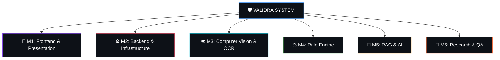

# Validra — Team Domain Ownership Mapping (M1–M6)

This document defines the official module domain boundaries and file ownership for Team VisionMinds (SIH 2026 Problem Statement 26034).

---

## 1. Team Domain Mapping

### 1.1 Domain Ownership Details

| Domain Tag | Responsibility | Core Scope | Directories / Files Owned | GitHub Tag |
|:---:|:---|:---|:---|:---:|
| **M1** | 🎨 **Frontend & Presentation** | Next.js, UI/UX, Scanning interface, Enforcement Dashboard, Reports UI, Evidence viewer | `frontend/app/`, `frontend/components/`, `frontend/lib/`, `frontend/public/` | `frontend` |
| **M2** | ⚙️ **Backend & Infrastructure** | FastAPI, REST APIs, PostgreSQL, Auth/JWT, RBAC, Object Storage, Task orchestration | `backend/app/api/`, `backend/app/core/`, `backend/app/database/`, `backend/app/models/`, `backend/app/schemas/` | `backend` / `db` |
| **M3** | 👁️ **Computer Vision & OCR** | OpenCV preprocessing, OCR engine, Text detection, Bounding boxes, Readability analysis | `cv/preprocessing/`, `cv/detection/`, `cv/ocr/`, `cv/extraction/` | `cv` |
| **M4** | ⚖️ **Rule Engine** | Legal Metrology rule formalization, Validation logic, Violation severity, Rule repository | `rule-engine/rules/`, `rule-engine/validators/`, `rule-engine/evaluators/` | `rule-engine` |
| **M5** | 🧠 **RAG & AI** | Legal document ingestion, Vector embeddings, Context retrieval, LLM explanations | `rag/ingestion/`, `rag/retrieval/`, `rag/embeddings/`, `rag/generation/` | `rag` |
| **M6** | 🔬 **Research & QA** | Datasets, Model benchmarking, Rule validation testing, E2E testing, SIH docs | `research/`, `tests/`, `docs/` | `qa` / `research` |

---

## 2. Cross-Module Modification Protocol

To preserve codebase integrity and prevent team conflict:

1. **Strict Ownership**: Never modify code inside another domain's path without prior agreement.
2. **Interface First**: Define Pydantic / TypeScript interface contracts before connecting two modules.
3. **Cross-Module Request**: If a task assigned to domain `M1` requires a change in `M2` (Backend API):
   - Document the API request parameter / response payload requirement.
   - Coordinate with the `M2` domain owner.
   - Record the cross-module dependency in `implementation.md`.
